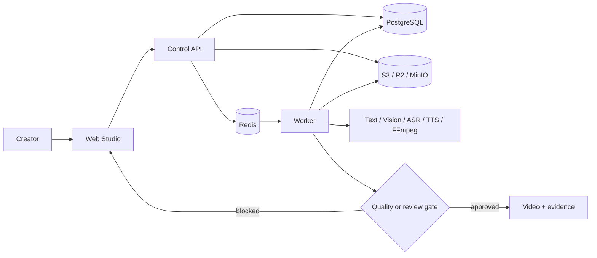

# Vistora

**Skill-driven AI video production with durable execution, governed assets, and auditable quality gates.**

Vistora 是一套面向创作者与内容团队的 AI 视频生产系统。它将研究、写作、配音、素材选择、时间线渲染、质量检查和人工审核组织为可恢复的持久化流水线，并把创作方法封装为可验证、可发布、可分叉的 Skill。

> **项目状态：积极开发中。** 当前版本主要服务于单用户、单默认工作区的本地和自托管场景。生产部署前必须补齐身份网关、外部服务、监控、备份与发布验收。

## 为什么是 Vistora

传统的自动视频脚本通常把提示词、账号配置、素材目录和 FFmpeg 命令耦合在一起，难以恢复、审计和复用。Vistora 将这些职责拆分为明确边界：

- **Skill 是方法**：保存输入、研究、写作、视觉、素材和质量策略，而不是可执行脚本。
- **Pipeline 是流程**：定义步骤依赖和能力要求，不绑定具体供应商。
- **Run 是不可变快照**：固定 Skill、Pipeline、素材库和生产设置，重试不会悄悄改变输入。
- **Artifact 是证据**：研究、脚本、音频、素材清单、视频和质检报告均内容寻址并可追溯。
- **审核是状态机的一部分**：来源不足、素材不匹配或质量警告会暂停生产，而不是被包装成成功。

## 当前能力

| 领域 | 已实现能力 | 重要边界 |
| --- | --- | --- |
| 创作与项目 | 单任务、批量生成、步骤状态、取消、重试、人工审核 | 当前以单默认工作区为主 |
| Skill Studio | 创建、编辑、校验、测试、发布、分叉、不可变版本 | Skill 仅包含声明式策略 |
| 研究与写作 | OpenAI-compatible 结构化研究、来源门禁和脚本生成 | 研究只引用 Run 输入中明确提供的 HTTPS URL |
| 音频与渲染 | Edge TTS、字幕、FFmpeg 合成和解码级音视频质检 | 依赖本地媒体桥和 FFmpeg/ffprobe |
| 素材治理 | 上传、来源/许可、扫描、关键帧、视觉分析、审核、软删除 | 只有 eligible 素材可以进入 Run |
| 素材选择 | 按 Run 绑定素材库执行场景检索并保存使用快照 | 零覆盖或语义不足时 fail closed |
| 执行可靠性 | PostgreSQL 状态、Redis 唤醒、租约、幂等、CAS 和崩溃恢复 | Redis 不是唯一事实来源 |
| API 与契约 | FastAPI、OpenAPI 3.1、JSON Schema 2020-12 | 完整请求认证仍需部署层提供 |

未配置的 Provider 会产生明确的能力错误或审核状态。系统不会生成占位成片，也不会把缺少来源、版权、素材覆盖或真实媒体检查的结果误报为成功。

## 执行模型



标准生产 Pipeline 依次处理研究、写作、配音、素材选择、渲染和质量评估。每个步骤持久化 revision、租约、输入快照、输出 Artifact 和审核记录；API 或 Worker 重启后可从持久状态恢复。

## 技术架构

| 组件 | 技术与职责 |
| --- | --- |
| `apps/web` | React 19、Vinext；创作、项目、Skill、素材、频道和设置界面 |
| `apps/api` | FastAPI；资源控制面、并发控制、幂等、OpenAPI 和对象访问授权 |
| `services/worker` | Python Worker；步骤调度、Provider 适配、素材分析、渲染和 QC |
| `packages/contracts` | OpenAPI 3.1 与 JSON Schema 2020-12 契约 |
| `packages/seeds` | 官方 Skill 起点和标准生产 Pipeline |
| `db/migrations` | PostgreSQL 前向迁移与校验和账本 |
| `deploy` | 隔离本地持久化栈和生产 Compose 基线 |
| `tools/release` | 安全、恢复、对象完整性、素材和 E2E 发布门禁 |

内部 Python/Node 包名和环境变量仍保留 `framefactory` / `FRAMEFACTORY_` 前缀，这是迁移兼容边界，不表示 Vistora 会连接旧 FrameFactory 数据。

## 快速开始

### 环境要求

- Windows PowerShell
- Python 3.12 x64
- Node.js 22.13 或更高版本
- Docker Desktop
- `ffmpeg` 与 `ffprobe`（启用本地配音、渲染和媒体质检时）

在仓库根目录运行：

```powershell
.\start.ps1
```

启动器会创建或复用 `.venv`、安装锁定依赖、启动 Vistora 独立基础设施、执行校验和迁移，并启动 API、Worker 和 Web。

| 服务 | 本地地址 |
| --- | --- |
| Web | <http://localhost:4173/create> |
| API / OpenAPI | <http://127.0.0.1:8200/docs> |
| PostgreSQL | `127.0.0.1:55432`，数据库与用户均为 `vistora` |
| Redis | `127.0.0.1:56379`，namespace 为 `vistora-local` |
| MinIO | API `127.0.0.1:59000`，Console `127.0.0.1:59001` |

本地 Compose 项目名为 `vistora-local`，数据库、Bucket、Redis namespace 和数据卷均独立于旧项目。

```powershell
.\start.ps1 -NoInstall -NoBrowser
.\stop.ps1
.\stop.ps1 -Infrastructure
```

普通停止仅终止脚本管理的 API、Worker 和 Web。`-Infrastructure` 还会停止本仓库容器；两种方式都保留数据卷。

## Provider 配置

本地密钥放在被 Git 忽略的 `var/secrets/worker-provider.env`。启动器只接受其白名单内的文本、视觉和 ASR 配置，并在启动 Worker 后移除当前 PowerShell 进程中的敏感环境变量。

主要 Provider 边界：

- `FRAMEFACTORY_OPENAI_*`：研究、写作和可选文本质量评估。
- `FRAMEFACTORY_ASSET_VISION_*`：上传素材的视觉分析。
- `FRAMEFACTORY_ASR_*`：语音素材转写与安全切点。
- Edge TTS 与 FFmpeg：由本地媒体桥提供配音、渲染和解码级 QC。

不要提交 API Key、Provider URL 中的凭据、运行日志、下载素材或生成视频。`var/` 的完整边界见 [本地运行数据说明](var/README.md)。

## 开发与验证

```powershell
# API、Worker 与跨包契约
.\.venv\Scripts\python.exe -m pytest apps/api/tests services/worker/tests tests/contract
.\.venv\Scripts\python.exe -m ruff check apps/api services/worker

# Web
Set-Location apps/web
$env:PYTHON = (Resolve-Path ..\..\.venv\Scripts\python.exe).Path
npm test
npm run lint
```

发布验收位于 `tools/release/`。Gate 缺少专用目标、fixture、凭据或外部能力时返回 `BLOCKED`；`BLOCKED` 不是通过，也不得人工覆盖为绿色。

## 安全与生产边界

根启动器只适用于本机开发。`deploy/production/` 是自托管基线，不包含完整公网防护。正式环境至少需要：

- HTTPS 反向代理和身份感知网关；
- 精确 CORS、稳定用户/工作区标识和独立 Secret；
- 生产 PostgreSQL、Redis、对象存储及 TLS/私网；
- 监控、告警、容量限制、备份和定期恢复验证；
- 与实际 Pipeline 相匹配的 Provider；
- 同一候选提交上的安全、E2E、恢复和完整性 Gate 证据。

API Key 管理接口目前不会自动为所有 HTTP 请求启用认证。不要把本地默认凭据用于共享或公网环境。

## 文档

- [文档索引与历史资料边界](docs/README.md)
- [Control API](apps/api/README.md)
- [Web 工作台](apps/web/README.md)
- [Worker 与 Provider](services/worker/README.md)
- [数据库迁移](db/README.md)
- [生产部署](deploy/production/README.md)
- [OpenAPI 与 JSON Schema](packages/contracts/README.md)
- [素材发布验收矩阵](tools/release/ASSET_ACCEPTANCE_MATRIX.md)

`docs/reference-v3/` 只保存旧仓库的历史经验。旧路径、Run ID、端口、测试数量和能力状态不能作为当前操作依据。

## 许可

Copyright © 2026 Vistora copyright holders. All rights reserved.

本项目采用 [PolyForm Noncommercial License 1.0.0](LICENSE.md)，属于**源代码可见的非商业许可**，不是 OSI 批准的开源许可。

在遵守完整许可条款和保留许可通知的前提下，允许的典型用途包括：

- 个人学习、研究、实验和测试；
- 无预期商业应用的私人娱乐、业余项目；
- 慈善、教育、公共研究、公共安全/健康、环保和政府机构用途。

未经版权所有者另行书面商业授权，不得将本软件用于商业产品、收费服务、企业内部商业活动、客户交付、转售，或其他直接或间接商业目的。修改和再分发同样只能用于许可允许的目的，并必须向接收者提供完整许可条款或其官方 URL。

第三方依赖、模型、字体、媒体和用户导入素材分别受其自身许可和权利约束；Vistora 的软件许可不会替代这些授权。许可解释以英文 [LICENSE.md](LICENSE.md) 原文为准。商业授权请通过 [GitHub 仓库](https://github.com/JimmyZhang06/vistora) 联系版权所有者。
