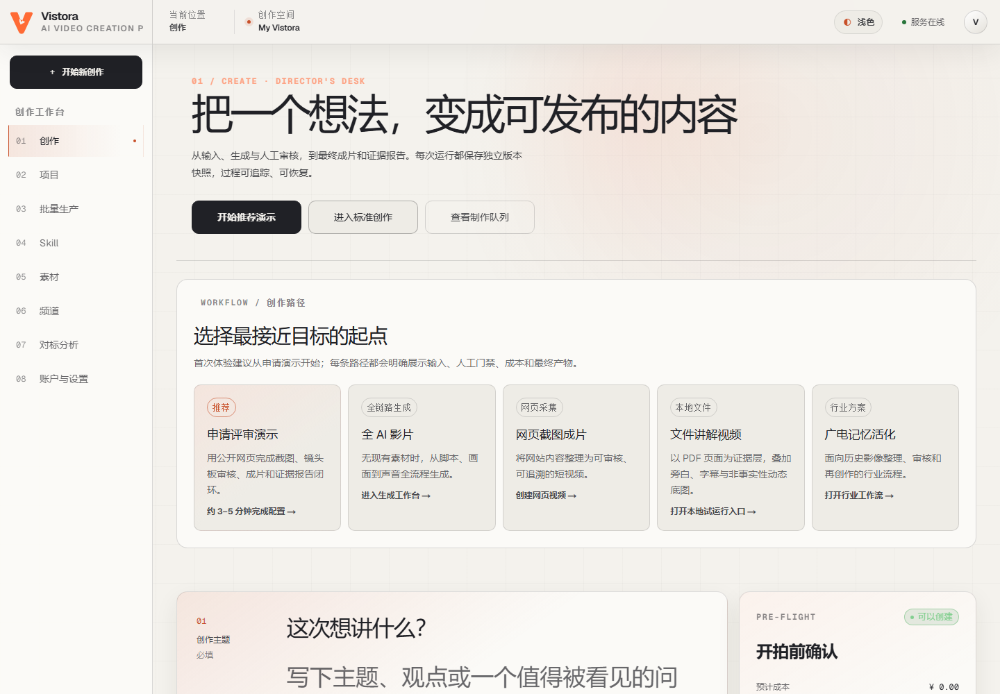
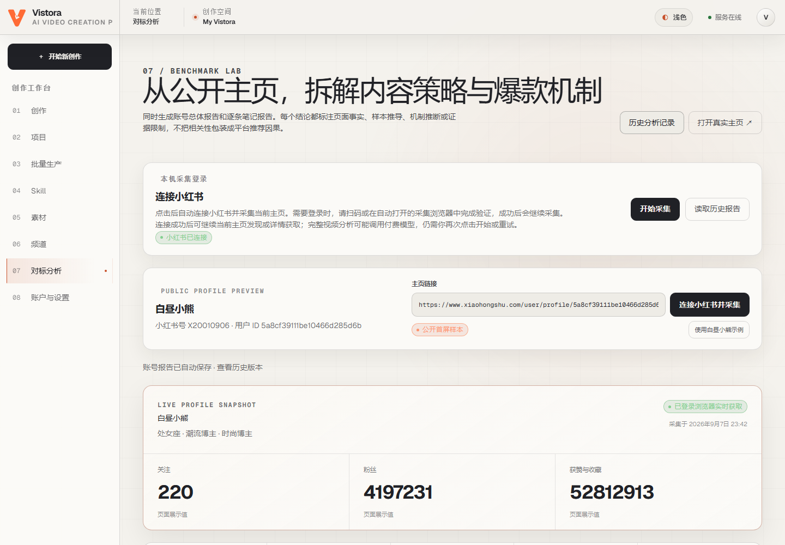
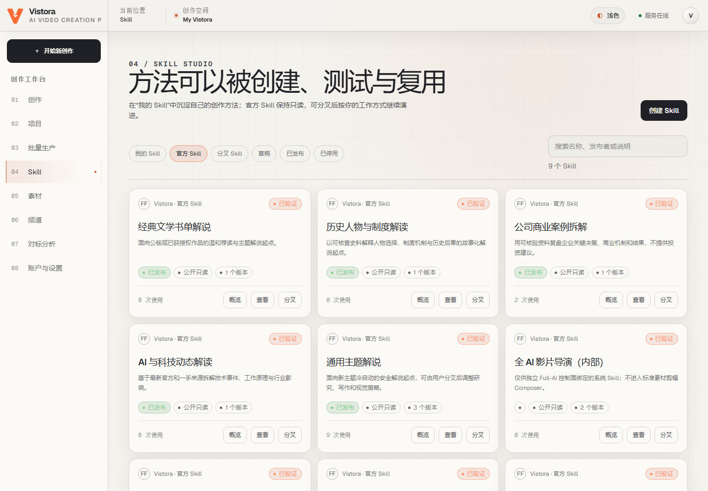
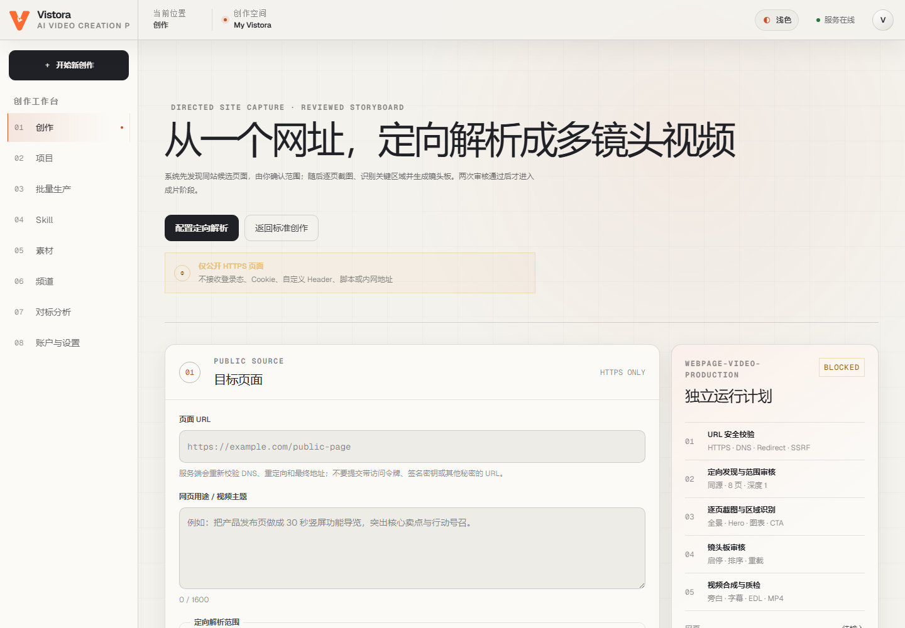

# Vistora

**让创作方法可复用，让视频生产可追溯。**

Vistora 是面向个人创作者与内容团队的 AI 视频生产工作台。它将研究、写稿、配音、素材选择、镜头规划、渲染与人工审核串成可恢复的工作流，并用版本化 Skill 保存创作方法。

[快速开始](#快速开始) · [界面预览](#界面预览) · [功能概览](#功能概览) · [开发指南](#开发指南) · [文档中心](docs/README.md)

> **项目状态：持续开发中。** 当前面向单用户、单默认工作区的本机与可信内网使用。各生产管线依赖实际部署能力、外部服务及人工审核；本仓库不代表已完成公网多租户或全部生产场景验收。

## 界面预览

以下为本地运行界面的真实截图。页面中的数据、连接与能力状态仅代表截图时的环境，不构成功能验收结论。

**创作工作台** — 从主题、网页或文档选择创作路径。



<details>
<summary><strong>展开查看小红书对标、Skill Studio 与网页成片</strong></summary>

**小红书对标** — 连接本机采集浏览器，读取公开主页与笔记。图中为应用内置的公开示例账号，并非登录者的账号资料。



**Skill Studio** — 浏览官方创作方法，按需分叉并维护自己的版本。



**网页截图成片** — 配置公开页面、采集范围与镜头审核。图中环境未开启所需能力，因此保留了实际的 `BLOCKED` 状态。



</details>

截图来源与更新方式见 [截图说明](assets/readme/README.md)。

## 功能概览

| 模块 | 能力 | 使用条件与边界 |
| --- | --- | --- |
| 标准素材生产 | 研究、脚本、配音、素材检索、字幕、时间线与 FFmpeg 成片 | 需要文本服务、媒体工具链与合格素材；证据或素材覆盖不足时进入审核 |
| 网页截图成片 | 同站页面发现、截图、区域识别、镜头板、旁白与视频合成 | 需要独立 Browser Capture Worker；仅支持公开 HTTPS 页面 |
| PDF 文档讲解 | 上传校验、页面与文本证据、镜头板、配音、合成与最终审核 | 需要 Poppler、文本服务和对象存储；目标环境完整 E2E 仍待验收 |
| Full-AI 影片 | 生成式脚本、配音、视频生成、视觉验证与付费操作账本 | 默认关闭；需配置生成服务、模型、价格与条款快照及输出权利声明 |
| 小红书对标 | 本机浏览器登录、公开主页与笔记采集、视频分析、历史报告 | 基础采集无需模型密钥；深度分析需额外依赖与相应模型配置 |
| 素材与批量生产 | 素材库、上传校验、来源许可、分析审核、批次及运行跟踪 | 生产仅选用通过质量、安全和权利门禁的素材 |
| Skill Studio | 声明式方法编辑、校验、发布、分叉与版本管理 | 已发布版本不可变；不执行任意用户代码 |

### 网页截图成片

输入公开网址后，系统发现同站候选页面，由用户确认采集范围；独立浏览器 Worker 截取页面并提取区域证据，再生成可审核的镜头板。镜头审核通过后，系统完成写稿、配音、字幕、画面运动与合成，并保存截图、来源、审核和成片之间的关联。

该管线不接收登录 Cookie、自定义脚本或私网地址，不支持绕过验证码。复杂交互页面可能无法完整采集；技术质量检查不替代事实、版权与审美审核。

### 小红书连接与分析

项目自带有界面的 Chromium 采集浏览器，无需外部插件或手动复制 Cookie：

1. 使用 `start.cmd -Xiaohongshu` 启动，进入 `/benchmarks`。
2. 输入公开主页地址，点击「连接小红书并采集」。
3. 如需登录或安全验证，在采集浏览器中本人扫码并完成平台验证。
4. 项目核验登录后继续当前免费采集；视频深析由用户另行点击，报告可在历史页读取。

“浏览器已打开”与“登录已核验”是不同状态。等待到期或平台限制发生时，按页面提示完成验证，再点击检查或重试；历史报告读取不依赖重新扫码。采集以公开首屏样本和可读取笔记为限，不保证完整历史覆盖，分析推断不等于平台推荐机制的因果证明。

详细说明：[连接与恢复](docs/sop/xiaohongshu-connection.md) · [采集边界](docs/sop/xiaohongshu-benchmark-provider.md) · [视频深析](docs/sop/benchmark-video-analysis.md)

## 快速开始

### 环境要求

推荐使用 Windows 本地集成启动器；其他环境的组件部署见各组件文档。

| 依赖 | 要求 |
| --- | --- |
| Git | 用于获取仓库 |
| Python | 3.12，64 位 |
| Node.js / npm | Node.js ≥ 22.13，附带 npm |
| Docker Desktop | 使用 Linux 容器引擎，提供 PostgreSQL、Redis 与 MinIO |
| PowerShell | 7.2 或更新；`start.cmd` 可在缺失时安装经校验的便携版本 |
| 媒体工具 | 视频渲染需要 FFmpeg / ffprobe；PDF 处理另需 Poppler |

首次安装需联网。启动器按模式安装 Python、Web 和浏览器依赖；模型服务及媒体能力是否可用，以启动检查和页面提示为准。

### 获取并启动

```powershell
git clone https://github.com/JimmyZhang06/vistora.git
cd vistora
.\start.cmd
```

启动器负责虚拟环境、依赖安装、基础设施、数据库迁移、API、Worker 与 Web 的启动和就绪检查。文本模型未配置时可启动工作台，依赖这些模型的生产能力保持关闭。

按需要选择启动模式，参数可以组合：

```powershell
# 小红书登录与公开主页、笔记采集
.\start.cmd -Xiaohongshu

# 小红书采集，以及可选视频深析依赖
.\start.cmd -BenchmarkAnalysis

# 公开网页截图成片：增加独立浏览器 Worker 与本地出站代理
.\start.cmd -BrowserCapture
```

同样配置重复启动会核对源码、进程与健康状态后复用实例。切换模式、更新运行代码或修改配置后，使用 `-Restart`；依赖已完整安装时可加 `-NoInstall`：

```powershell
.\start.cmd -Xiaohongshu -NoInstall -Restart
```

`-NoBrowser` 仅关闭自动打开 Web 页面的行为，采集浏览器仍保留界面供本人验证。

### 访问与停止

| 服务 | 默认地址 |
| --- | --- |
| Web 工作台 | http://127.0.0.1:4173/create |
| API 文档 | http://127.0.0.1:8200/docs |
| API 就绪检查 | http://127.0.0.1:8200/readyz |
| PostgreSQL | `127.0.0.1:55433` |
| Redis | `127.0.0.1:56380` |
| MinIO API / Console | `127.0.0.1:59002` / `127.0.0.1:59003` |

**以启动终端输出的地址为准。** 默认端口被占用时，启动器会选择可用端口并同步相关配置；显式指定的端口不可用时会报出原因。

```powershell
# 停止应用进程，保留本地数据
.\stop.cmd

# 同时停止基础设施容器，保留数据卷
.\stop.cmd -Infrastructure
```

遇到启动失败，先查看终端提示与 `var/logs/`。Docker 问题需确认 Desktop 的 Linux 引擎可用；能力为 `blocked` 时应补齐对应配置或工具，而不是反复刷新页面。

## 配置与本地数据

### 模型与外部服务

按需创建被 Git 忽略的 `var/secrets/worker-provider.env`。以下仅为占位示例，需替换为实际服务地址、密钥与模型名：

```dotenv
FRAMEFACTORY_OPENAI_BASE_URL=https://provider.example.com/v1
FRAMEFACTORY_OPENAI_API_KEY=replace-locally
FRAMEFACTORY_OPENAI_RESEARCH_MODEL=research-model
FRAMEFACTORY_OPENAI_WRITING_MODEL=writing-model
FRAMEFACTORY_OPENAI_QUALITY_MODEL=quality-model
```

根启动器只导入其允许的配置字段；不要将整个组件 `.env.example` 原样复制到这个文件。也可用 `-ProviderEnvFile` 指定另一份本地私密配置。

素材视觉分析、ASR、结构化搜索与 Full-AI 使用独立配置。仅配置文本模型不足以支持没有来源 URL 的主题研究，也不足以开启完整视频深析或 Full-AI 生产。外部服务可能计费，应按实际服务设置预算与调用限制。

配置参考：[API 示例](apps/api/.env.example) · [Worker 示例](services/worker/.env.example) · [Worker 能力说明](services/worker/README.md) · [Full-AI 管线](docs/FULL_AI_VIDEO_PIPELINE.md)

### 数据位置

主生产工作流使用 PostgreSQL 保存状态，以 S3 兼容对象存储保存 Artifact；小红书分析任务与历史报告另有本地 SQLite 和文件存储。备份与迁移应同时考虑这两类数据。

| 路径 | 内容 |
| --- | --- |
| `var/secrets/` | 本机 Provider 配置 |
| `var/browser/xiaohongshu/` | 独立 Chromium 档案与登录会话 |
| `var/benchmark-analysis/` | 本地分析数据库及相关文件 |
| `var/logs/`、`var/runtime/` | 日志、进程记录与运行状态 |

这些目录不应提交到 Git。采集浏览器不读取个人 Chrome / Edge 档案，登录凭据仍由 Chromium 保存在其私有目录中；不要把该目录当作普通报告分享。更多约定见 [本地数据边界](var/README.md)。

## 架构与核心概念

Web 提供创作、审核与管理界面；Control API 负责资源、输入校验与状态控制；Worker 执行生产任务。PostgreSQL 是主工作流的事实来源，Redis 承担至少一次投递和唤醒，S3 兼容存储保存媒体与证据。公开网页采集使用独立 Worker，本机小红书浏览器则属于独立的本地研究通道。

| 概念 | 职责 |
| --- | --- |
| **Skill** | 定义输入、研究、写作、视觉与质量策略 |
| **Pipeline** | 声明步骤依赖、重试、超时、审核门与能力要求 |
| **Run** | 冻结 Skill、Pipeline、设置与素材快照，跟踪一次生产 |
| **Artifact** | 保存脚本、音频、截图、时间线、视频及报告的哈希与来源 |
| **Review** | 将人工批准、退回与修订记录纳入工作流状态 |

Worker 通过持久化步骤、租约与修订号处理并发、重试、取消和崩溃恢复；这不等于外部服务具有 exactly-once 执行保证。备份恢复和付费调用幂等性仍需在目标环境验收。

```text
apps/web/              React、Vinext、TypeScript 与 Tailwind 工作台
apps/api/              FastAPI 控制面与本地采集服务
services/worker/       调度、Provider、采集、媒体处理与恢复
packages/contracts/   OpenAPI 与 JSON Schema 公共契约
packages/seeds/        官方 Skill 与 Pipeline 版本
db/                   PostgreSQL 迁移
deploy/               本地基础设施与生产部署基线
tools/                验证、运维与发布门禁
docs/                 架构、操作手册与历史资料
```

部分 Python 包名与环境变量保留 `framefactory` / `FRAMEFACTORY_` 前缀，以兼容现有配置。架构细节见 [当前工程架构](docs/ACTUAL_ENGINEERING_ARCHITECTURE.md)。

## 开发指南

以下命令在仓库根目录执行。先完成本地启动所需依赖，再安装开发与契约测试依赖：

```powershell
.\.venv\Scripts\python.exe -m pip install -e "./apps/api[dev]" -e "./services/worker[dev]" -r tests/contract/requirements.txt
.\.venv\Scripts\python.exe -m playwright install chromium
```

分别执行后端测试，避免不同组件的测试配置相互干扰：

```powershell
.\.venv\Scripts\python.exe -m pytest apps/api/tests
.\.venv\Scripts\python.exe -m pytest services/worker/tests
.\.venv\Scripts\python.exe -m pytest tests/contract tools/tests
.\.venv\Scripts\python.exe -m ruff check apps/api/src apps/api/tests services/worker
```

前端验证：

```powershell
cd apps/web
npm ci
npm run lint
npm run typecheck
npm test
```

`npm test` 包含生产构建。数据库、对象存储与外部 Provider 的集成测试需要单独配置隔离环境；跳过这些测试不代表端到端通过。常规自动化检查与受保护的发布门禁见 [Release gates](.github/workflows/release-gates.yml)。

提交改动时，请附上问题说明、复现步骤与验证结果。涉及 API 或数据结构时同步更新公共契约、迁移和文档；UI 改动可附不含私人数据的截图。不要提交密钥、浏览器档案、用户素材或运行产物。

## 安全与当前限制

- **身份边界**：当前默认工作区属于单用户模式。工作区请求头和 API Key 管理页面不构成完整请求认证；公网部署需要真实身份、授权与隔离方案。
- **浏览器边界**：公开网页采集需要连接路径上的出站代理或防火墙来阻断私网及云元数据地址；应用层 URL 校验不能单独替代这一边界。小红书登录通道仅限本机使用。
- **内容与权利**：来源、许可与人工审核是生产输入的一部分。技术 QC 不保证事实正确或第三方内容可再利用；小红书连接不代表官方 OAuth 或平台合作。
- **PDF 能力**：当前接受带文本层、未加密且不含 JavaScript 的 PDF，上限为 200 MiB、100 页；扫描件 OCR 未实现。完整上传、两次审核、成片下载及版本化删除需在目标环境验收。
- **尚未提供的能力**：自动发布到社交平台、完整多用户工作区管理和任意网页交互自动化。频道管理目前主要保存配置与元数据。
- **发布验证**：真实扫码、付费模型、负载、崩溃恢复与备份还原需要对应环境实测。单次构建成功、界面截图或历史通过记录均不能替代当前版本的发布门禁。

部署前阅读 [生产部署基线](deploy/production/README.md)、[数据库迁移与恢复](db/README.md) 和 [发布验收矩阵](tools/release/ASSET_ACCEPTANCE_MATRIX.md)。

## 文档导航

| 主题 | 文档 |
| --- | --- |
| 全部文档与阅读顺序 | [文档中心](docs/README.md) |
| 前端开发 | [Web README](apps/web/README.md) |
| API 与权限上下文 | [Control API README](apps/api/README.md) |
| Worker 与 Provider | [Worker README](services/worker/README.md) |
| 接口与官方方法 | [公共契约](packages/contracts/README.md) · [官方 Seed](packages/seeds/README.md) |
| PDF 本地渲染试验 | [Document hybrid pilot](examples/document-hybrid/README.md) |
| 批量生产设计 | [批量生产与素材库](docs/BATCH_LIBRARY_IMPLEMENTATION_PLAN.md) |

## 许可

本项目采用 [PolyForm Noncommercial License 1.0.0](LICENSE.md)，具体授权范围以许可正文为准。第三方依赖、模型、字体与媒体素材遵循各自的许可和服务条款。
