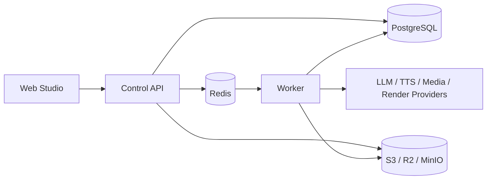

# Vistora

> Skill-driven AI video production for creators and content teams.

Vistora 是一套面向创作者与小型内容团队的 AI 视频生产平台。它把创作方法封装为可版本化的 **Skill**，并用可恢复的生产流水线串联脚本、配音、素材、时间线、渲染、质检与人工审核，让一次创作经验可以被复用、测试和持续改进。

## 核心能力

- **创作工作台**：从创作需求发起生产任务，查看步骤、产物、错误与恢复状态。
- **Skill Studio**：创建、测试、发布和分叉 Skill；草稿支持版本校验，发布版本保持不可变。
- **素材智能**：上传或导入素材，记录来源与版权信息，完成内容寻址、镜头分析、语义检索和候选素材编排。
- **频道管理**：配置频道定位、平台、受众和内容方向，并将频道上下文组合进创作任务。
- **可靠执行**：基于 PostgreSQL 与 Redis 的持久化任务编排，支持租约、重试、取消、幂等和崩溃恢复。
- **质量控制**：以条件质量门禁和人工审核阻止不完整或证据不足的产物被误报为成功。
- **开放契约**：通过 OpenAPI 与 JSON Schema 约束 API、Skill、Pipeline、Run 和 Channel 数据。

## 系统架构



| 目录 | 职责 |
| --- | --- |
| `apps/web` | 基于 React 与 Vinext 的创作、Skill、素材、频道和设置界面 |
| `apps/api` | FastAPI 控制面，负责账户、Skill、Run、频道和素材接口 |
| `services/worker` | 可恢复步骤调度、供应商适配、素材分析与视频生产任务 |
| `packages/contracts` | OpenAPI v1 与 JSON Schema 契约 |
| `packages/seeds` | 官方只读 Skill 和默认生产 Pipeline |
| `db/migrations` | 带校验和保护的 PostgreSQL 迁移 |
| `deploy/production` | API、Worker 与基础设施的生产部署基线 |

## 快速开始

### 环境要求

- Windows PowerShell
- Python 3.12 x64
- Node.js 22.13 或更高版本
- 已启动的 Docker Desktop

在仓库根目录运行：

```powershell
.\start.ps1
```

启动器会创建隔离的 Python 环境、安装依赖、启动 PostgreSQL、Redis 与 MinIO、执行数据库迁移，并启动 API、Worker 和 Web。

打开 <http://127.0.0.1:4173/create> 进入创作工作台。

```powershell
.\stop.ps1                 # 停止应用进程，保留基础设施与数据
.\stop.ps1 -Infrastructure # 同时停止容器，仍保留数据卷
```

运行日志保存在 `var/logs/`。默认本地配置面向单用户、单工作区开发环境；模型、语音、素材和渲染能力取决于已配置的供应商。

## 开发与验证

```powershell
# API
.\.venv\Scripts\python.exe -m pytest apps/api/tests
.\.venv\Scripts\python.exe -m ruff check apps/api

# Worker
.\.venv\Scripts\python.exe -m pytest services/worker/tests
.\.venv\Scripts\python.exe -m ruff check services/worker

# API 与数据契约
.\.venv\Scripts\python.exe -m pytest tests/contract

# Web
Set-Location apps/web
$env:PYTHON = (Resolve-Path ..\..\.venv\Scripts\python.exe).Path
npm test
npm run lint
```

GitHub Actions 会执行 API、Worker、Web、契约与发布安全门禁。生产验收工具位于 `tools/release/`；当外部服务、凭据或验收目标未配置时，相关门禁会明确报告 `BLOCKED`，不会把缺少能力当成通过。

## 文档

- [API 与本地持久化](apps/api/README.md)
- [Worker 与供应商边界](services/worker/README.md)
- [生产部署、备份与恢复](deploy/production/README.md)
- [OpenAPI 与 Schema 契约](packages/contracts/README.md)

## 生产部署说明

`deploy/production` 提供自托管基线，但不是完整的公网安全边界。正式环境必须配置 HTTPS、独立身份认证、外部 PostgreSQL/Redis/S3 凭据、密钥管理、监控、备份，以及真实的模型和媒体供应商。未配置的执行能力会失败并留下可审计记录，不会生成占位成片或虚报成功。

## 项目状态

Vistora 正在积极开发中，当前以单用户、单工作区为主要运行模式，同时在数据模型与接口中保留未来扩展所需的 `workspace_id` 边界。
