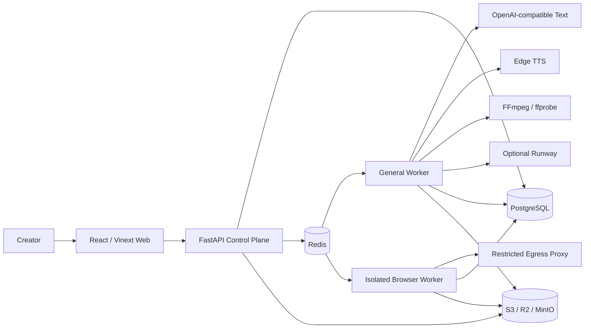

# Vistora

**Skill-driven AI video production with durable workflows, governed media, and auditable human gates.**

Vistora 是一套面向个人创作者与内容团队的 AI 视频生产系统。它把研究、写作、配音、素材治理、网页采集、镜头规划、时间线渲染和质量检查组织为可恢复的持久化工作流，并将创作方法封装为可验证、可发布、可分叉的声明式 Skill。

> **项目状态：积极开发中（截至 2026-09-05）。** 当前版本面向单用户、单默认工作区的本地和可信内网场景。网页截图成片已有真实公开官网 Run 证据；标准素材、PDF 文档和 Full-AI 管线均受部署能力、素材/来源、人工审核及外部 Provider 约束。PDF 管线的代码、契约和保护性 E2E Gate 已接通，但目标环境中的真实上传、两次审核、成片下载与版本化删除验收仍是发布阻断项。应用自身尚未形成公网多租户身份边界。

## 核心设计

Vistora 不把视频生产实现为一个不可恢复的长脚本，而是将职责拆成可审计边界：

- **Skill 是方法**：保存输入、研究、写作、视觉、素材和质量策略，不允许携带任意可执行代码。
- **Pipeline 是流程**：声明步骤依赖、重试、超时、审核门和能力要求，不绑定具体模型供应商。
- **Run 是冻结快照**：固定 SkillVersion、PipelineVersion、生产设置和素材库，重试不会悄悄改变语义。
- **Artifact 是证据**：研究、脚本、音频、截图、素材清单、时间线、视频和质检报告均保存哈希与来源。
- **审核是状态机的一部分**：来源不足、素材不合格、网页范围变化或质量风险会暂停流程，而不是被包装为成功。
- **数据库是事实来源**：Redis 负责至少一次投递和唤醒；PostgreSQL 保存权威状态、租约、事件和恢复信息。

## 当前真实能力

### 四条视频生产管线

| 管线 | 当前状态 | 能力与边界 |
| --- | --- | --- |
| **网页截图成片 v2** | 本地环境可用，已有真实成功 Run | 公开 HTTPS URL、同源定向发现、人工范围审核、逐页截图、关键区域识别、镜头审核、旁白、字幕、连续慢速聚焦和 FFmpeg 成片 |
| **标准素材生产** | 条件可用 | 结构化研究、写稿、Edge TTS、素材库检索、时间线、字幕、FFmpeg 和技术 QC；素材缺失或权利/安全证据不足时进入人工审核 |
| **PDF 文档混合讲解** | 代码与控制面已实现，目标环境 E2E 待验收 | 不可变 PDF 上传、整文件哈希、安全检查、页面证据、两次人工审核、程序化非事实背景、旁白、合成渲染、QC、保留期、Legal Hold 与持久化删除 |
| **Full-AI generated-only** | 代码与控制面已实现，默认未启用 | 生成式脚本、TTS、Runway 视频生成、独立视觉验证、付费操作账本、EDL 与 QC；只有 Provider、模型、价格/条款快照和输出权利声明全部配置后才开放 |

未配置的 Provider 或缺失的 Worker capability 会使创建入口明确显示 `blocked`。系统不会生成占位视频，也不会把缺少真实媒体、版权证据或解码检查的结果标记为成功。

### 网页截图成片

网页管线是当前最完整的独立生产入口，适合将公开官网制作成介绍型短视频：

1. 校验目标 URL、公开页面声明和素材使用权声明；
2. 仅允许 HTTPS，并拒绝 URL 凭据、私网、回环、链路本地和云 metadata 目标；
3. 在同源范围内定向发现页面，默认最多 8 页、深度 1，硬上限为 12 页、深度 2；
4. 保存带 revision 与 SHA-256 的页面范围清单，必须由用户批准；
5. 独立 Browser Capture Worker 等待字体、可见图片、DOM 和加载指示器趋于稳定后逐页截图；
6. 从 DOM 与页面视觉结构识别关键区域，并保留原始完整截图；
7. 生成带稳定 ID 的镜头板，用户可审核镜头启停、顺序、运动方式与转场；
8. 写作、配音和素材物化后，按真实 PNG 像素坐标聚焦关键区域；
9. 对静态画面应用连续缓动推近、拉远或平移，并可使用淡黑过渡；使用清晰主体加模糊铺底适配竖屏；
10. 输出 H.264/AAC 视频，并执行解码、音轨、黑屏、静音、分辨率和时长检查。

申请证据工作区在成功 Run 后记录匿名化客户细分、制作前后耗时、修改次数、采用结果、满意度与付费意愿，并提供跨试点汇总和可打印报告。多页面 Run 还会把已启用镜头关联到页面 URL、视觉哈希、范围清单哈希、镜头板哈希和最终成片哈希；报告不会包含会过期的签名媒体链接或试点备注。

当前限制：只支持公开页面，不提供登录 Cookie、自定义浏览器脚本、跨域爬取、CAPTCHA 绕过或任意交互自动化；复杂 WebGL、无限滚动、严格反爬和必须交互后才出现的内容不保证完整。技术 QC 也不能替代人工判断每个镜头的语义焦点和审美质量。当前证据链覆盖视觉镜头来源，逐句旁白与网页原文的声明级映射仍未实现；试点指标由团队录入，系统不将其表述为独立核验结果。

### PDF 文档混合讲解

`/create/document-video` 将用户拥有或获准使用的文本型 PDF 转成可审核的中文讲解视频：浏览器先计算 SHA-256，再通过预签名 URL 上传；API 复核对象大小、类型和完整哈希并冻结来源快照；Worker 使用 Poppler 与 `pypdf` 检查文件、提取页面证据、生成脚本和 Storyboard，把页面截图作为事实层，再配音、对齐时间线、合成 H.264/AAC 成片并执行解码级 QC。Storyboard 与最终质量报告都是必经人工审核点。

输入上限为 200 MiB、100 页，仅接受未加密、无 JavaScript、带文本层的 PDF。扫描件不会静默 OCR；当前会以“OCR 未配置”明确失败。`media.augment` 在 Agnes 未配置时只生成并披露非事实程序化背景，不会把装饰画面冒充来源证据。独立本地 Pilot 可用于无 API/队列/S3 的渲染冒烟测试，但不能替代生产链路验收。

Document Source 还提供 revision-fenced retention、Legal Hold 和异步 Purge。Purge Worker 在删除原 PDF 与所有派生 Artifact 的对象版本后才写入 sanitized tombstone，同时保留 Run、Step、Review、哈希 lineage 与审计事件。当前 Web 尚无保留/删除管理面板，这些仍是 API/运维控制。

### 素材与批量生产

- 创建素材库，上传图片或视频，单文件描述上限为 5 GiB；
- 使用预签名上传、SHA-256 完整性校验和工作区对象键；
- 保存来源、许可、归属、标签、媒体探测、关键帧、片段和分析证据；
- 支持素材审核、禁用、软删除、恢复、批量标签和重新分析；
- 支持 YouTube、Bilibili、Wikimedia 的受限检索，以及受支持 URL 的定向导入；
- 公有领域自动建库只接受 Wikimedia 的可验证权利证据；
- 批量任务最多 5,000 条，支持状态分页、取消和失败重试；
- 标准 Run 只能使用绑定素材库中通过安全、许可和可用性门禁的素材。

### Skill Studio 与控制面

- Skill 创建、JSON 导入、官方 Skill Fork、编辑和归档；
- SkillVersion 草稿、静态语义验证、发布和不可变版本；
- 声明式输入 Schema、研究/写作/视觉/素材/QC 策略与输出契约；
- 本地确定性版本比较，用于发现配置差异；
- Run、Step、Artifact、Event、批次和人工审核控制面；
- Channel 元数据管理和 Run 关联。

尚未实现：示例蒸馏服务、真实模型 A/B Skill 测试、平台官方 OAuth 账号绑定、自动上传/发布视频、用户/工作区管理、Pipeline 管理、RenderPreset 管理和 2FA。小红书对标支持下述本机浏览器扫码连接。

### 小红书对标分析 Demo

`/benchmarks` 内可检查小红书连接，并在用户点击后显示本机 Provider 的登录二维码；用户在小红书 App 扫码后，系统重新验证登录状态，再恢复当前账号的免费采集或详情获取。二维码过期、服务未配置和连接失败均可明确恢复。扫码不会启动或重试付费视频分析，也不关闭已有浏览器登录。此流程是本机受管浏览器登录，不能视为平台官方 OAuth 或创作者内容再利用授权；安装及操作见 [小红书连接流程](docs/sop/xiaohongshu-connection.md)。已保存的账号及视频报告可在 `/benchmarks/history` 只读查看。

真实视频深析现已接通：在单条视频报告点击「开始完整视频分析」，自动从已登录主页定位视频，完成全时长场景扫描、代表帧视觉理解、OCR、VAD/ASR 与音轨测量，再生成证据化策略报告。最多 36 帧，不宣称逐帧穷尽；按账号＋笔记持久保存，支持恢复、取消和重试。本机启动用 `./start.ps1 -BenchmarkAnalysis`，安装、Provider、预算、保留期及生产边界见 [视频深析 SOP](docs/sop/benchmark-video-analysis.md)。此通道不改变现有账号总体报告的首屏元数据范围。

`/benchmarks` 可粘贴规范的小红书用户主页 URL，并保留白昼小熊（用户 ID `5a8cf39111be10466d285d6b`，小红书号 `X20010906`）作为一键 Seed。`POST /v1/benchmark-accounts/preview` 通过 Provider 注册表选择采集器；当前小红书 Provider 只接受精确的 `https://www.xiaohongshu.com/user/profile/{24 位用户 ID}`，会移除分享查询参数后请求公开 HTML，并生成视频/图文占比、近 30 天发布量、发布间隔、点赞下界、标题主题信号和首屏高互动样本。采集设置 8 秒超时、1 MiB 响应上限、拒绝重定向和按规范主页隔离的 5 分钟进程内缓存（最多 128 个主页）；不抓评论或收藏，不下载媒体，也不持久化源数据。兼容用的 `GET /v1/benchmark-accounts/demo` 仍指向 Seed。

`POST /v1/benchmark-accounts/report` 在同一快照上生成账号总体报告和逐条笔记报告。报告使用账号内互动下界百分位识别“高表现候选”，归纳对话式标题、第一人称、反差、方法承诺、感官意象、地点、数字和极简悬念等可复测策略。所有爆款解释都区分样本推导、机制推断和证据限制；当前深度为 `public_metadata_only`，不声称已分析正文、封面、视频语音、镜头、曝光、完播或分享。

`POST /v1/benchmark-notes/source-evidence` 已实现本机可替换的真实详情 Provider：它从已登录受管浏览器中的规范主页发现并点击目标笔记，返回正文、互动量精度和媒体探针，同时不输出 Cookie、短期令牌或签名媒体 URL。完整运行、安全与页面兼容流程见 [`docs/sop/xiaohongshu-benchmark-provider.md`](docs/sop/xiaohongshu-benchmark-provider.md)。

`POST /v1/benchmark-notes/deep-report` 保留为旧的证据转换入口，其最新结果仅是进程内缓存；系统样片接口明确标注 `synthetic_demo`，不是目标账号证据。`/benchmarks` 的完整视频面板现使用新的 `/v1/benchmark-analysis/jobs` 耐久接口，不再把旧的工作区全局最新报告绑定到任意笔记。新通道使用本地隔离研究文件和 SQLite，不假称已经集成生产对象存储。

这是可运行的技术验证，不是全量监控器：公开 SSR 的主页总量可能降精度，首屏仍有 `hasMore` 时所有分析都会明确标为样本结论。账户采集不依赖单篇媒体解析网站。登录会话由用户本机外部浏览器 Provider 管理；Vistora 不接收、返回或归档 Cookie，也不把登录二维码写入历史报告。扩展完整分页或公网服务前，需要评估平台条款、速率限制、数据保留和隔离执行边界。

## 系统架构



### 运行组件

| 目录 | 职责 |
| --- | --- |
| `apps/web` | React 19 + Vinext 工作台；标准、Full-AI、网页、PDF、档案活化、申请演示、证据中心、对标分析、项目、批次、Skill、素材、频道和设置 |
| `apps/api` | FastAPI 控制面；资源生命周期、幂等、并发控制、审核、签名 URL 和 Provider readiness |
| `services/worker` | DAG 调度、Provider 适配、素材分析、浏览器采集、渲染、QC 和恢复 |
| `packages/contracts` | OpenAPI 3.1 与 JSON Schema 2020-12 公共契约 |
| `packages/seeds` | 官方 Skill、SkillVersion 和版本化 Pipeline |
| `db/migrations` | PostgreSQL 前向迁移、约束、控制面和付费操作账本 |
| `deploy` | 本地持久层与生产后端 Compose 基线 |
| `tools/release` | 安全、备份恢复、S3 完整性、素材和 E2E 发布门禁 |

内部包名与环境变量保留 `framefactory` / `FRAMEFACTORY_` 前缀，这是迁移兼容边界；产品与仓库品牌统一为 Vistora。

### 执行与恢复语义

1. API 校验已发布的 SkillVersion 与 PipelineVersion，并把 ID、内容哈希和设置冻结到 Run；
2. API 在 PostgreSQL 中幂等创建 Run，再向 Redis 发布唤醒消息；
3. Worker 从 PostgreSQL 重读冻结定义并物化有向无环图；
4. Step 通过 Redis delivery lease 与数据库 execution lease 双重保护；
5. 输出先写入对象存储并校验哈希，再持久化 Artifact 与 Step 结果；
6. 只有持久化成功后才 ACK 队列消息；
7. 恢复扫描会重新发现待物化、到期重试和租约过期的工作。

这是 **at-least-once** 执行模型，不承诺消息只出现一次；幂等键、CAS 状态迁移、确定性对象键和不可变 Artifact 用于实现效果去重。

## 快速开始

### 环境要求

- Windows PowerShell 7；
- Python 3.12 x64；
- Node.js 22.13 或更高版本；
- Docker Desktop；
- FFmpeg 与 ffprobe；
- PDF 文档视频需要 Poppler（`pdfinfo`、`pdftoppm`）与 Python `pypdf`；
- 网页截图需要 Playwright Chromium 运行时；
- 研究与写作需要 OpenAI-compatible 文本 Provider。

### 启动

```powershell
# 标准素材生产、API、Worker 和 Web
.\start.ps1

# 额外启用独立网页截图 Worker 和本地受限出站代理
.\start.ps1 -BrowserCapture

# 复用已安装依赖
.\start.ps1 -NoInstall -BrowserCapture
```

启动器会：

- 创建或校验 `.venv`；
- 安装锁定的 API、Worker 和可选 Browser 依赖；
- 启动独立 PostgreSQL、Redis、MinIO；
- 执行数据库迁移与迁移账本校验；
- 计算本次可声明的 Worker capability；
- 对数据库、队列、对象存储、文档工具链和付费账本执行启动前健康检查；
- 启动 API、普通 Worker、可选 Browser Worker 与 Web。

| 服务 | 本地地址 |
| --- | --- |
| Web | <http://localhost:4173/create> |
| API 文档 | <http://127.0.0.1:8200/docs> |
| API readiness | <http://127.0.0.1:8200/readyz> |
| PostgreSQL | `127.0.0.1:55433`，数据库与用户均为 `vistora` |
| Redis | `127.0.0.1:56380`，namespace 为 `vistora-local` |
| MinIO API | `127.0.0.1:59002` |
| MinIO Console | `127.0.0.1:59003` |
| Browser development proxy | `127.0.0.1:58888`，仅在 `-BrowserCapture` 下启动 |

本地 Compose 项目名为 `vistora-framefactory-local`。停止命令默认保留数据：

```powershell
.\stop.ps1
.\stop.ps1 -Infrastructure
```

## Provider 配置

本地 Provider 凭据放在被 Git 忽略的 `var/secrets/worker-provider.env`。不要把真实密钥写入 `.env.example`、README、命令历史或 Git 提交。

```dotenv
FRAMEFACTORY_OPENAI_BASE_URL=https://provider.example.com/v1
FRAMEFACTORY_OPENAI_API_KEY=replace-locally
FRAMEFACTORY_OPENAI_RESEARCH_MODEL=research-model
FRAMEFACTORY_OPENAI_WRITING_MODEL=writing-model
FRAMEFACTORY_OPENAI_QUALITY_MODEL=quality-model
```

可选 Provider：

- `FRAMEFACTORY_ASSET_VISION_*`：上传素材的视觉分析；
- `FRAMEFACTORY_ASR_*`：语音素材转写与词级安全切点；
- `FRAMEFACTORY_RUNWAY_*`：Full-AI 视频生成；
- `FRAMEFACTORY_FULL_AI_VISION_*`：生成视频的独立视觉验证；
- `FRAMEFACTORY_RESEARCH_SEARCH_*`：外部结构化搜索服务。

仅配置文本模型不足以支持“只有主题、没有来源 URL”的标准创作。此类 Run 默认采用
`research_mode=when_missing`，还必须配置 `FRAMEFACTORY_RESEARCH_SEARCH_URL` 与独立的
`FRAMEFACTORY_RESEARCH_SEARCH_BEARER_TOKEN`；否则研究步骤会按策略失败关闭。根启动器会从
同一个私密 Provider 文件导入这些字段。

Full-AI readiness 还要求不可变价格/条款快照、输出权利声明、S3、FFmpeg、文本模型和视觉验证模型全部可用。缺少任一条件时 API 会保持 fail-closed。

## API 与契约

- 运行 API：`http://127.0.0.1:8200/openapi.json`；
- Canonical OpenAPI：`packages/contracts/openapi/v1.yaml`；
- JSON Schema：`packages/contracts/schemas/v1/`；
- 官方目录：`packages/seeds/official-skills/v1/manifest.json`。

HTTP 写操作使用 `Idempotency-Key`，版本化更新使用 revision/ETag/`If-Match`。签名媒体 URL 短期有效，不暴露对象存储凭据或内部对象键。

## 开发与验证

API、Worker 和 Contract 测试拥有各自的 `conftest.py`，应分进程运行，避免测试模块名碰撞：

```powershell
# API
.\.venv\Scripts\python.exe -m pytest apps/api/tests

# Worker
.\.venv\Scripts\python.exe -m pytest services/worker/tests

# 跨包契约
.\.venv\Scripts\python.exe -m pytest tests/contract

# Python 静态检查
.\.venv\Scripts\python.exe -m ruff check apps/api services/worker tests

# Web
Set-Location apps/web
$env:Path = (Resolve-Path ..\..\.venv\Scripts).Path + ";" + $env:Path
npm test
npm run lint
```

生产门禁位于 `.github/workflows/release-gates.yml` 和 `tools/release/`。需要专用数据库、对象存储、受保护凭据或外部 Provider 的检查在缺少条件时必须报告 `BLOCKED`；`BLOCKED` 不等于通过。

## 安全与部署边界

根启动器仅用于本地开发。`deploy/production/` 是 API、Worker 和持久层的自托管基线，不包含完整前端托管、身份网关、WAF、指标告警和组织级 Secret 管理。

当前安全边界：

- 应用使用默认单用户、单工作区上下文；请求中的工作区 Header 不是租户授权边界；
- API Key 具备创建、哈希存储、列出和撤销能力，但尚不能认证 HTTP 请求；
- 登录会话不会由当前部署创建，2FA 明确不可用；
- Browser Worker 与普通 Worker 使用独立进程、队列、凭据和对象键前缀；
- 生产网页采集必须由外部代理或防火墙在连接层阻断私网、回环、链路本地和 metadata 地址；配置声明本身不能代替真实网络策略；
- 用户必须对网页和远程素材的使用权负责，系统保存确认与证据但不提供法律授权。

正式公网部署至少需要：

1. HTTPS 反向代理和身份感知网关；
2. 真实用户、工作区选择和租户隔离；
3. 精确 CORS、独立数据库角色和最小权限 Secret；
4. 生产 PostgreSQL、Redis、对象存储和 TLS/私网；
5. Browser Worker 的可验证出站防火墙；
6. 指标、日志聚合、告警、容量限制和 Provider 成本上限；
7. 定期备份、空库恢复演练和 S3 完整性审计；
8. 同一候选提交上的构建、测试、安全、恢复和真实 E2E 证据。

## 已知限制

- 当前不是公网多租户 SaaS；
- Full-AI 默认不启用，且会产生第三方费用；
- 标准素材生产不能保证自动找到符合语义与版权要求的素材；
- 网页管线不支持登录页、Cookie 会话、CAPTCHA 绕过或任意交互脚本；
- PDF 管线不支持加密、JavaScript 或纯扫描文档；OCR、恶意语料压力测试和接近 200 MiB 的容量证据尚未完成；
- 自动 QC 主要覆盖技术完整性，不能代替事实、版权和审美审核；
- Document retention、Legal Hold 与 Purge 目前只有 API/运维入口，尚无自助 Web 管理页；
- Channel 目前不执行第三方平台发布；
- Pipeline、RenderPreset、User 和 Workspace 管理 API 仍为保留的 501 接口；
- Canonical OpenAPI、Pydantic、Web TypeScript 和 Worker 模型仍需人工保持同步。

## 文档

- [文档中心](docs/README.md)
- [当前工程架构](docs/ACTUAL_ENGINEERING_ARCHITECTURE.md)
- [Full-AI 视频管线](docs/FULL_AI_VIDEO_PIPELINE.md)
- [批量生产与素材库设计](docs/BATCH_LIBRARY_IMPLEMENTATION_PLAN.md)
- [产品工程就绪矩阵](docs/PRODUCT_ENGINEERING_READINESS_MATRIX.md)
- [PDF 文档混合讲解 Pilot](examples/document-hybrid/README.md)
- [HKSTP Ideation 申请材料](docs/application/hkstp-ideation-26-23/README.md)
- [Control API](apps/api/README.md)
- [Web 工作台](apps/web/README.md)
- [Worker 与 Provider](services/worker/README.md)
- [数据库迁移](db/README.md)
- [生产部署](deploy/production/README.md)
- [OpenAPI 与 JSON Schema](packages/contracts/README.md)
- [官方 Seed](packages/seeds/README.md)
- [发布验收矩阵](tools/release/ASSET_ACCEPTANCE_MATRIX.md)
- [本地运行数据边界](var/README.md)

`docs/reference-v3/` 保存历史设计资料。旧路径、端口、Run ID、测试数量和能力状态不能作为当前运行依据。

## 许可

Copyright © 2026 Vistora copyright holders. All rights reserved.

本项目采用 [PolyForm Noncommercial License 1.0.0](LICENSE.md)，属于源代码可见的非商业许可，不是 OSI 批准的开源许可。个人学习、研究、实验和许可允许的公益用途可以在遵守完整条款的前提下使用；商业产品、收费服务、企业内部商业活动、客户交付和转售需要另行取得书面商业授权。

第三方依赖、模型、字体、媒体和用户导入素材分别受其自身许可与权利约束。Vistora 的软件许可不会替代这些授权；解释冲突时以英文 [LICENSE.md](LICENSE.md) 原文为准。
