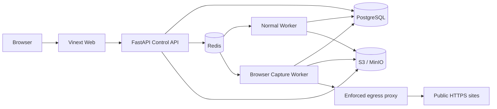

# Vistora 当前工程架构

> 文档状态：当前架构基线
> 适用范围：仓库当前实现；不是生产认证或一次性审计报告
> 更新原则：实现、契约或部署拓扑变化时同步更新

Vistora 是一个围绕版本化 Skill/Pipeline、可恢复媒体生产 DAG、不可变 Artifact 和人工审核构建的单仓库系统。当前定位是可信网络内的单用户、单默认工作区生产内核，不是开箱即用的公网多租户 SaaS。

## 1. 架构结论

系统采用“模块化控制面 + 独立执行进程”的边界：

- Web 负责创建、审核、项目、素材和配置交互；
- FastAPI Control API 负责资源、并发、幂等、readiness 与任务控制；
- PostgreSQL 是业务与运行状态的权威来源；
- Redis 只承担至少一次投递、唤醒与租约协作；
- S3-compatible 存储保存截图、音频、视频和结构化 Artifact；
- 普通 Worker 执行研究、写作、素材、音频、时间线、渲染与 QC；
- Browser Capture Worker 在独立队列、进程、凭据和网络中执行不可信网页访问。

不建议在当前阶段拆成更多微服务。身份、契约生成、能力就绪、出站网络和发布证据比增加服务数量更重要。

## 2. 运行拓扑



生产 Web、HTTPS 反向代理、身份网关、WAF、监控平台和组织级 Secret 管理不包含在默认 Compose 中。

## 3. 组件责任

| 组件 | 权威责任 | 明确不负责 |
| --- | --- | --- |
| Web | 表单、状态展示、人工审核、错误恢复入口 | 不伪造服务端成功，不回退生产 Mock |
| Control API | 资源生命周期、权限 seam、幂等、CAS、Run/Batch 控制 | 不执行媒体任务，不把 API Key 元数据接口当请求认证 |
| PostgreSQL | Resource、Run、Step、Artifact、审计与快照状态 | 不存放大媒体字节 |
| Redis | 队列唤醒、租约和去重协作 | 不是 Run 真相源 |
| Object Storage | 内容寻址或受约束对象、预签名读写 | 不决定业务状态 |
| Normal Worker | Provider 调用、素材检索、TTS、时间线、渲染、QC | 不访问任意网页浏览器会话 |
| Capture Worker | 公开 HTTPS 发现、稳定等待、截图和页面证据 | 不持有文本模型、Runway、素材分析或普通 Worker Secret |

## 4. 三条视频管线

### 4.1 标准素材生产

`standard-production` 使用研究、脚本、音频、素材候选、选择、EDL 和质量报告。v3 面向批量生产，先从创建批次时冻结的 `CatalogSnapshot` 生成库存摘要，再进行只读检索；剪辑过程中禁止临时素材补采。

```text
research.collect -> media.inventory -> writing.compose
                                     -> audio.synthesize
                                     -> media.retrieve
audio + retrieval -> timeline.align -> render.edl -> quality.evaluate
```

能力条件：结构化文本 Provider、素材库、对象存储、TTS、FFmpeg/FFprobe 和对应 Worker operations 必须同时可用。素材权利或语义覆盖不足时 fail closed。

### 4.2 网页截图成片

`webpage-video-production/v2` 是独立控制面。它先定向发现同站页面，等待页面稳定后分别截图，再生成区域证据和 Storyboard；用户审核页面范围与镜头顺序后，普通 Worker 才物化批准截图、写稿、配音和渲染。

Browser Worker 只负责不可信网络边界内的发现与截图。页面内容不直接成为可信提示词，必须经过结构化证据与人工审核。登录页、Cookie 会话、CAPTCHA 绕过和任意交互脚本不在支持范围。

### 4.3 Full-AI 生成

`full-ai-production/v2` 只使用 Run 范围的生成素材，不读取共享素材库，也不回退到远程素材下载。默认配置为 blocked；只有报价、条款、权利、预算、生成 Provider、独立视觉验证和媒体能力全部就绪时才允许创建付费 Run。

详细不变量见 [Full-AI 视频管线](FULL_AI_VIDEO_PIPELINE.md)。

## 5. 状态、并发与恢复

创建与动作请求使用 `Idempotency-Key`；相同键配不同请求体必须冲突。可变资源通过 `ETag`/`If-Match` 或 revision CAS 防止丢失更新。

Pipeline 在创建 Run 时冻结 SkillVersion、PipelineVersion、素材库/快照、声音、渲染与生产设置。Worker 将图物化为 `run_steps`，以租约和 fencing 防止过期消费者提交结果；恢复扫描从 PostgreSQL 重建漏发任务和过期租约。

Artifact 先写对象存储并计算哈希，再以不可变引用进入数据库。跨 PostgreSQL、Redis 和对象存储不存在单个分布式事务，因此依赖幂等对象键、条件写、状态机与恢复扫描收敛。

## 6. 数据与契约

契约由三层组成：

1. `packages/contracts/openapi/v1.yaml`：HTTP 公共接口；
2. `packages/contracts/schemas/v1/`：资源与不可变 Artifact 载荷；
3. `packages/seeds/official-skills/v1/`：经校验的 Skill/Pipeline 声明式种子。

Pydantic、TypeScript 和 Worker 运行模型仍需与静态契约同步。路由双向一致性、Schema 引用、迁移和 runtime wiring 由合同测试覆盖，但当前没有完整代码生成单一来源。

数据库迁移保持前向且不可修改；已执行文件的 SHA-256 记录在 `schema_migrations`，迁移入口使用 PostgreSQL advisory lock 串行化。

## 7. 安全与权利边界

当前 `DefaultWorkspaceContextProvider` 固定返回安装时配置的用户与工作区；`X-Workspace-Id` 不是租户授权边界。API Key 可以创建、哈希存储和撤销，但当前不会认证所有 HTTP 请求。公网部署必须增加身份感知网关或实现等价的应用内认证授权。

网页采集同时需要两层防护：应用校验 URL、DNS、重定向和子资源；连接路径上的代理/防火墙在每次连接时拒绝私网、回环、链路本地、Unix socket、容器网段和云 metadata，并防止 DNS rebinding。配置布尔值只是运维断言，不是网络策略证明。

用户对网页和素材使用权负责。系统记录用户声明、来源、哈希、分析与审核证据，但不会自动授予版权或平台转载许可。

## 8. 部署与可观测性

根 `start.ps1` 是本地集成入口；`deploy/docker-compose.persistence.yml` 只提供本地持久层；`deploy/production/compose.yml` 是后端自托管基线。生产环境必须补齐：

- HTTPS、身份、精确 CORS 与网络分段；
- 最小权限数据库/Redis/S3 账户及独立 Capture 凭据；
- Provider 成本、超时、速率和并发限制；
- 队列等待、失败率、租约恢复、对象一致性、OOM 和任务超时告警；
- PostgreSQL 备份、空库恢复演练、对象版本化或异地复制；
- 同一候选提交上的真实 PostgreSQL/Redis/S3、浏览器沙箱和 Provider Gate。

## 9. 已知工程边界

| 优先级 | 边界 | 影响 |
| --- | --- | --- |
| P0（公网发布） | 缺少真实请求认证和多租户授权 | 不能直接暴露为公网 SaaS |
| P1 | Capture 出站策略依赖外部代理/防火墙 | 未验证时存在 SSRF 与 DNS-rebinding 风险 |
| P1 | 生产 Secret、备份恢复和真实 Provider E2E 依赖安装环境 | 单元测试不能证明生产就绪 |
| P2 | OpenAPI、Pydantic、TypeScript 与 Worker 模型仍需人工同步 | 变更可能出现契约漂移 |
| P2 | API 与部分 Web/Worker 模块较大 | 增加维护和评审成本，但当前不要求拆服务 |

## 10. 关键入口

| 目的 | 路径 |
| --- | --- |
| Web 路由与组件 | `apps/web/app/`、`apps/web/components/` |
| Web API adapter | `apps/web/lib/api/` |
| API 装配与路由 | `apps/api/src/framefactory_api/main.py` |
| API 服务与仓储 | `apps/api/src/framefactory_api/service.py`、`postgres_repository.py` |
| 网页/Full-AI 控制面 | `webpage_video.py`、`full_ai.py` |
| Worker 调度 | `services/worker/framefactory/runtime/` |
| Worker Provider 与能力 | `services/worker/framefactory/worker/` |
| Browser Capture | `services/worker/framefactory/worker/web_capture/` |
| 契约与 Seed | `packages/contracts/`、`packages/seeds/` |
| 迁移与部署 | `db/migrations/`、`deploy/`、`start.ps1` |
| 发布门禁 | `.github/workflows/release-gates.yml`、`tools/release/` |

## 11. 验证原则

长期文档不保存易过期的通过数量。每次发布必须在同一候选提交上重新执行根 README 中的分组测试，并把真实基础设施或 Provider 缺失报告为 `BLOCKED`，不能用 Mock 或内存 Repository 冒充端到端通过。
