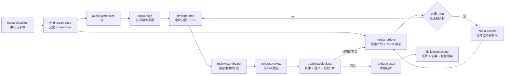

# Vistora v3 素材检索与剪辑流程优化方案

> 文档分类：历史参考（非当前实施计划）

> **历史快照边界**：本文从旧仓库 `v3/docs` 迁入，只描述 2026-08-19 至 2026-08-20 的 v3 工作树。文中的路径、Run ID、进度、阈值和“当前”结论不代表新 Vistora 仓库现状；现行说明从 [`../../README.md`](../../README.md) 进入，并以代码、迁移和自动化测试为准。

> 文档状态：历史实施设计稿｜截至 2026-08-20 已完成首轮语义时间线与自动补采闭环
> 制定日期：2026-08-19（Asia/Shanghai）
> 原适用范围：旧仓库 `v3/` 当时的架构与工作树
> 前置评审：[`V3_ARCHITECTURE_AND_EDITING_REVIEW.md`](V3_ARCHITECTURE_AND_EDITING_REVIEW.md)

## 1. 目标与结论

### 实施进度快照（2026-08-20）

| 能力 | 状态 | 验证 |
| --- | --- | --- |
| 旁白语义 → 结构化原子 Beat | 已实现首版 | 制造流程、应急处置与单源人物剧情基准 |
| 单调全局时间线规划 | 已实现首版 | 剧情顺序、片段不越界、0 padding 自动门禁 |
| 字幕/ASR/词间隙安全切点 | 已实现基础版 | `temporal_cut_v1.json` |
| 按缺失 Beat 自动补采与恢复 | 已实现受限闭环 | Run `571b7d12-345c-42cf-9095-7fced3c50287` |
| 解码级黑屏/静音/流 QC | 已实现 | Run `8b63c9f7-2bc9-4476-9441-8b862666fa19` |
| 独立 `timeline.plan` 步骤与可编辑 EDL | 未完成 | 当前时间线仍由 Render capability 产出 |
| Top-K/评分分解/向量混合召回 | 未完成 | 当前仍以数据库文本和标签规则为主 |
| 真实长电影金标集与逐帧语义 QC | 未完成 | 当前只有脱敏剧情结构和时间切点小基准 |

结构化故障知识与生产算法回归入口统一放在 `services/worker/benchmarks/semantic_timeline_v1.json`；任何后续修复都应追加故障代码和回归测试，不能只更新说明文字。生产实现禁止加入案例题材词典，题材相关实体、动作、地点和排除项必须来自 Skill/Run 的结构化 Beat。

本方案不重写现有 Web、Control API、Worker 状态机或 Run/Step/Artifact 模型，而是在它们之上补出一条可解释、可审核、可局部重试的剪辑链路。

核心策略是：**先把文案拆成结构化叙事节拍（Beat），再为每个 Beat 制定素材需求和检索计划；素材检索只负责召回与评分，时间线规划负责全局分配，渲染器只消费已经冻结的 EDL；质量检查把问题退回到真正应该修改的步骤。**

落地后的每个镜头都必须能够回答：

- 对应哪一句旁白、哪个叙事目的；
- 为什么检索到它，实体、事件、年份和视觉动作是否匹配；
- 为什么选择它而不是其他候选；
- 入点、出点、切点依据和补帧量是多少；
- 是否重复、是否连续、是否具有可验证的使用权；
- 哪个机器门禁和人工审核批准了它。

## 2. 当前实现基础与直接问题

### 2.1 可以复用的能力

| 现有能力 | 当前位置 | 本方案中的用途 |
|---|---|---|
| Run/Step 状态机、租约、重试、审核 | `services/worker/framefactory/runtime/` | 保持不变，承载新增剪辑步骤 |
| 素材、文件、片段、字幕、镜头边界 | `db/migrations/0009_*`、`0011_*` | 作为本地素材检索底座 |
| 本地片段检索 | `worker/adapters/database_assets.py` | 下沉为检索适配器 |
| 外部素材补采 | API `/v1/asset-acquisitions` | 作为缺口补采执行器 |
| 查询规划雏形 | `worker/asset_acquisition_plan.py` | 升级为按 Beat 的查询计划 |
| 全局时间线算法雏形 | `worker/timeline.py` | 升级为独立的 EDL 规划步骤 |
| FFmpeg 成片 | `worker/adapters/legacy_media.py` | 只负责预览和母版渲染 |
| Artifact 与对象存储 | API、Worker storage ports | 保存计划、候选、时间线、QC 与成片 |

### 2.2 当前阻碍剪辑质量的问题

1. 文案中的 `scenes` 仍以字符串为主，缺少实体、事件、时间、地点、动作、镜头作用和可替代程度等机器可执行字段。
2. 本地检索主要使用 `search_text` 的 trigram 相似度与标签命中，适合同词匹配，不足以处理同义表达、跨语言查询和画面语义。
3. `database_assets.py` 同时做查询、补采、候选过滤和贪心选择，职责过重，难以单测、替换或解释。
4. 外部补采已经做到“每个故事查询每轮最多导入一个”，但查询槽位、候选拒绝原因、版权证据和失败轮次尚未形成完整持久化模型。
5. 时间线规划发生在 FFmpeg capability 内部，渲染之前无法查看故事板、替换镜头或只重跑时间线。
6. Run 会复制整部源视频作为 Artifact，多次 Run 会重复占用存储和传输；片段本应引用不可变 AssetFile。
7. `ArtifactKind` 尚未声明 `timeline`，而 Worker 已经产生 timeline Artifact；官方 output contract 也未完整声明运行时实际产物。
8. 技术 QC 仍无法证明画面是否黑帧、冻帧、重复、裁切错误或声画不一致。

## 3. 先区分三种剪辑模式

不能用同一套“素材越多越好”的规则处理电影解说和多来源资讯。建议在 `visual_policy` 中新增 `editing_mode`，也可以在兼容期由 Skill 推断：

| 模式 | 典型内容 | 检索与剪辑重点 | 外部补采 |
|---|---|---|---|
| `single_source_analysis` | 电影、剧集、访谈解说 | 绑定指定素材；强调角色、剧情顺序、场面连续和片段去重 | 默认禁止 |
| `multi_source_explainer` | 新闻、事件、知识解说 | 实体/事件/年份必须准确；强调来源和视觉多样性 | 按版权策略允许 |
| `stock_visual_explainer` | 抽象观点、方法论、品牌短片 | 动作、情绪、构图和风格优先；允许象征性 B-roll | 允许授权素材或生成素材 |

该字段决定候选硬门槛、来源多样性和时间顺序约束，避免电影解说因“同源过多”被误判，也避免资讯视频长期只使用同一个泛化素材。

## 4. 目标剪辑流水线



### 4.1 与现有操作枚举的兼容方式

第一阶段不立即扩充所有 operation，先使用现有契约完成数据解耦：

- `writing.compose` 同时输出 `script` 和 `beat manifest`；
- `audio.synthesize` 同时输出音频与 narration timing；
- `media.select` 输出 retrieval plan 和 candidate manifest，不直接决定最终镜头；
- 现有 `timeline.align` 升级为独立步骤并输出 EDL；
- `render.compose` 只消费 EDL；
- `quality.evaluate` 读取真实音视频并输出结构化 QC。

稳定后再发布 Pipeline v2，增加 `audio.align`、`media.retrieve`、`media.acquire`、`timeline.plan`、`render.preview` 和 `render.master`。旧 PipelineVersion 保持不可变，Run 继续快照对应版本。

## 5. 核心中间数据模型

### 5.1 BeatSpec：让文案变成可剪辑合同

`writing.compose` 不再只返回 narration 和字符串 scenes，而是为每个叙事单元返回结构化 Beat：

```json
{
  "beat_id": "beat-004",
  "narration": "2024 年 5 月，强烈太阳耀斑引发了罕见的低纬度极光。",
  "purpose": "evidence",
  "required": true,
  "entities": ["太阳", "极光"],
  "event": "2024-05 geomagnetic storm",
  "time_scope": {"from": "2024-05-10", "to": "2024-05-12"},
  "locations": [],
  "visual_actions": ["太阳爆发", "极光移动"],
  "preferred_shots": ["wide", "timelapse"],
  "continuity_group": "solar-storm",
  "fallback_policy": "related_event_only",
  "estimated_seconds": 6.2
}
```

其中 `required=true` 的 Beat 不允许用泛化画面静默填充；`fallback_policy` 可取 `exact_only`、`related_event_only`、`symbolic_allowed` 或 `text_card_allowed`。

### 5.2 RetrievalPlan：检索意图而不是一条查询词

每个 Beat 生成 2–4 个有顺序的检索意图：

1. `exact`：实体 + 事件 + 年份/地点；
2. `visual`：实体 + 可见动作 + 镜头类型；
3. `related`：受控同义词或上位概念，仅在策略允许时使用；
4. `cutaway`：解释性细节、环境或反应镜头，仅用于非必需 Beat。

```json
{
  "beat_id": "beat-004",
  "queries": [
    {"kind": "exact", "text": "May 2024 geomagnetic storm aurora", "must": ["2024", "aurora"]},
    {"kind": "visual", "text": "solar flare eruption timelapse", "must": ["solar flare"]}
  ],
  "source_route": ["workspace", "wikimedia", "licensed_remote"],
  "candidate_limit": 12,
  "acquisition_round_limit": 2
}
```

不得先执行一个宽泛的 topic 查询并耗尽整个 Run 的素材预算。预算应先按必需 Beat 分配，再把余量分给过渡和增强镜头。

### 5.3 CandidateManifest：保留候选和评分证据

候选清单至少保存 `beat_id`、`asset_id`、`asset_file_id`、`segment_id`、源时间段、代理文件引用、来源、权利状态、各分项得分、硬门槛结果和拒绝原因。检索结果不能只有最终被选中的素材，否则无法做替换、评估召回率或解释算法。

### 5.4 EditDecisionList：渲染器唯一输入

```json
{
  "schema_version": "1.0",
  "timeline_id": "...",
  "audio_artifact_id": "...",
  "shots": [
    {
      "shot_id": "shot-004-a",
      "beat_id": "beat-004",
      "segment_id": "...",
      "asset_file_id": "...",
      "source_in": 125.42,
      "source_out": 131.88,
      "timeline_in": 18.10,
      "timeline_out": 24.30,
      "crop": {"mode": "cover", "focus": [0.52, 0.35]},
      "transition": "cut",
      "cut_evidence": "shot_boundary+silence",
      "score": {"total": 0.78, "semantic": 0.82, "continuity": 0.71},
      "padding_seconds": 0,
      "locked": false,
      "issues": []
    }
  ]
}
```

Render capability 禁止重新选择素材、移动切点或隐式补齐时长。需要变更时必须生成新 EDL revision，使审核证据与最终视频一致。

## 6. 素材检索的具体策略

### 6.1 第 0 层：硬过滤

候选进入排名之前必须通过：

- Workspace/Library 绑定正确；
- Asset 与 AssetFile 为 `ready`，分析版本符合当前要求；
- 版权策略允许，并具有相应证据；
- 时长足够覆盖目标镜头和切点安全余量；
- 不位于片头片尾、字幕表、黑帧或损坏区间；
- 对含对白或 ASR 的片段，入点/出点不得位于单词或话语中间；
- `single_source_analysis` 必须来自 Run 绑定的源片；
- 实体、年份或互斥事件冲突时直接淘汰，不靠低分惩罚解决。

YouTube、Bilibili 的“可访问”不等于“已授权”。外部导入必须记录 `rights_basis`、`license_locator`、`captured_at` 和操作者 attestation；无法证明授权的素材只能进入 `awaiting_review/quarantined`，不能自动进入成片。

### 6.2 第 1 层：混合召回

本地素材建议并行形成四组召回集合，再合并去重：

1. **精确召回**：实体、事件、日期、地点和人物的规范化字段；
2. **文本召回**：现有 pg_trgm、关键词 GIN、字幕/ASR 全文检索；
3. **语义召回**：Beat 文本与 segment description/transcript 的文本 embedding；
4. **视觉召回**：代表帧或短片段 embedding，用自然语言检索真实画面内容。

第一版可以先保留 PostgreSQL，在 `asset_segments` 增加版本化向量列及 HNSW 索引：

- `text_embedding vector(N)`；
- `visual_embedding vector(N)`；
- `embedding_model`、`embedding_version`、`embedded_at`；
- 新模型上线时后台重算，查询只混用相同模型版本。

如果暂时不引入 pgvector，仍应先把检索接口和评分证据抽象出来，继续用 trigram 实现；这样增加向量召回时不必再次改动时间线和渲染器。

### 6.3 第 2 层：可解释重排

先把所有分项归一化到 `0..1`，再使用内容模式对应的权重。`multi_source_explainer` 的初始公式可设为：

```text
score = 0.30 * semantic
      + 0.20 * entity_event_time
      + 0.15 * visual_action
      + 0.10 * cut_safety
      + 0.08 * technical_quality
      + 0.07 * continuity
      + 0.07 * novelty
      + 0.03 * rights_confidence
      - reuse_penalty
      - nearby_source_penalty
      - padding_penalty
      - dialogue_cut_penalty
```

注意事项：

- 权利不合法是硬失败，`rights_confidence` 只区分合法证据的完整程度；
- `single_source_analysis` 提高 chronology、character、continuity 权重，移除来源多样性惩罚；
- `stock_visual_explainer` 提高 mood、composition、shot_type 权重；
- 阈值必须通过基准集校准，不能继续使用当前可超过 1 的混合分值直接判断质量；
- API/UI 应展示分项分数与拒绝原因，不只显示一个不可解释的总分。

### 6.4 第 3 层：外部补采

只有必需 Beat 在本地 Top-K 中没有合格候选时才触发补采：

1. 为缺失 Beat 建立 acquisition slot；
2. 按 source route 查询，每轮每个 slot 最多导入一个候选；
3. 下载后经过安全扫描、去重、版权验证、镜头切分、ASR 和 embedding；
4. 只重新评估对应 slot，不重跑已满足的 Beat；
5. 最多两轮，仍缺失则进入 `asset_coverage` 人工审核；
6. 审核人可选择替换查询、上传素材、允许文字卡或终止 Run。

来源路由建议：

- Workspace Library 永远第一优先；
- Wikimedia 只选明确 Public Domain、CC0 或允许使用的许可，并保存原始许可页面；
- YouTube/Bilibili 只用于用户具有权利依据的特定素材，不作为默认“免费素材库”；
- 生成媒体只有 Skill 的 `generated_media_allowed=true` 且 Beat 允许时才进入兜底。

建议新增 `0014_asset_retrieval_and_acquisition.sql`，持久化 acquisition request、slot、candidate、provider attempt 和 rights snapshot。现有 tags 可继续用于展示，但不能作为唯一审计记录。

## 7. 从局部选材升级为全局时间线分配

当前逐场景贪心选择会出现“每个镜头局部可用，但连起来重复、跳跃或叙事不顺”。正确做法是每个 Beat 保留 Top-K，然后由全局规划器一次决定整条时间线。

规划目标包括：

- 所有 required Beat 覆盖；
- 镜头总时长严格匹配旁白句/词级时间戳；
- 同一 segment 默认最多使用一次；
- 同一视觉指纹在时间线中的占比受限；
- 角色、地点、事件与电影剧情顺序保持连续；
- 切点靠近镜头边界、静音或话语边界；
- 减少无意义的短镜头、长定格和连续相似构图；
- 人工锁定的镜头、入出点和顺序不可被后续重试改变。

现有 `timeline.py` 的全局路径选择可以保留，但输入要从“脚本文本 + 最终 manifest”改成 `BeatSpec + NarrationTiming + CandidateManifest`，输出固定 EDL。它不再由 `FFmpegRenderCapability` 内部调用。

## 8. 音频作为剪辑主时钟

剪辑时长必须以真实旁白为准，不能靠字符数比例长期代替：

1. TTS 输出句级、词级或音素级时间戳；
2. Provider 不提供时间戳时，对合成音频做强制对齐；
3. 使用停顿、重音和句意边界生成可剪辑窗口；
4. 镜头变化落在语义转换或自然停顿附近；
5. 字幕直接使用同一 timing artifact，避免字幕、画面和旁白各自估算。

TTS 速度建议限制在目标音色正常语速的 `±10%`。预计成片时长偏差超过 `8%` 时，应回到 `writing.compose` 调整字数或结构，不能再用大幅减速、加速和定格画面补救。

## 9. 质量门禁与定向返工

### 9.1 第一版可执行阈值

以下数值是冷启动门槛，需用真实成片基准集继续校准：

| 指标 | 自动通过条件 | 失败去向 |
|---|---|---|
| required Beat 覆盖率 | 100% | `media.select/retrieve` |
| 镜头语义分 | 单镜头 ≥ 0.55，中位数 ≥ 0.68 | `media.select` 或 `timeline.align` |
| 实体/事件冲突 | 0 个 | `media.select` |
| 不安全对白切点 | 0 个 | `timeline.align` |
| 单镜头补帧 | ≤ 0.35 秒 | `timeline.align` |
| 全片补帧占比 | ≤ 1% | `timeline.align` |
| 同 segment 重复 | 0 次，人工锁定除外 | `timeline.align` |
| 黑帧/损坏帧 | 0 个持续性区间 | `render.compose` |
| 音频响度 | 平台 preset 范围内 | 音频后期/渲染 |
| 字幕越界与遮挡 | 0 个 error | `render.compose` |
| 权利证据缺失 | 0 个 | `media.select` 或人工审核 |

`single_source_analysis` 不限制单一源 Asset 的占比，但限制相同 segment、视觉指纹和邻近时间区间重复；`multi_source_explainer` 可额外限制同一来源占比，初始建议不超过全片的 45%。

### 9.2 QC 必须分析真实媒体

`quality.evaluate` 至少应组合：

- FFprobe：编码、帧率、分辨率、时长、音轨和容器；
- FFmpeg：blackdetect、freezedetect、silencedetect、响度和峰值；
- Timeline QC：覆盖、重复、切点、补帧、节奏、转场；
- Semantic QC：旁白 Beat 与最终帧/片段的相似度，以及实体冲突；
- Rights QC：EDL 中所有 `asset_file_id` 对应的权利证据快照；
- 视觉抽样：按镜头抽代表帧，生成 contact sheet 供机器与人工复核。

问题要携带 `issue_code + beat_id + shot_id + suggested_owner_step`。这样“第 7 镜头选错素材”只重跑检索/时间线，而不是重新研究、写作、TTS 和整片渲染。

## 10. 预览与人工审核体验

在 Run 详情页增加 Storyboard，而不是让审核人只下载最终视频：

- 一行一个 Beat，显示旁白、当前镜头、来源时间段和分项得分；
- 展示 3–5 个备选候选，可一键替换；
- 支持锁定镜头、调整入出点、修改检索词、允许文字卡；
- 显示“为何选中”和“为何淘汰”；
- 汇总 required Beat 覆盖、重复率、补帧量、来源与版权状态；
- 替换后只生成新的 EDL revision 和低码率 preview；
- 人工批准时把 EDL hash 写入 review evidence，母版必须消费同一 hash。

现有 `StepReviewRequest.issue_codes` 可以继续使用；建议增补可选 `targets`，用于携带 `beat_id`、`shot_id` 和时间区间，而不是把定位信息塞进自由文本 `reason`。

## 11. 存储与渲染优化

### 11.1 不再复制整部源片

Run Artifact 保存的应是候选清单、EDL 和不可变素材引用，而不是每个 Run 都复制一份源视频。引用至少包含：

- `asset_id`、`asset_file_id`、内容 hash 和对象存储 key；
- 使用的 source in/out；
- 分析版本和 rights snapshot id；
- 可复现的 proxy/mezzanine 版本。

只有交付包需要复制最终视频、字幕和权利清单。原始素材由 Asset 生命周期管理；被已发布 Run 引用时禁止物理删除，改为软删除或归档。

### 11.2 两级渲染

- Preview：720p、低码率、快速编码，可带 timecode 和 shot id 水印；
- Master：只有 Storyboard 和 Preview QC 通过后生成，使用目标 RenderPreset；
- 中间片段按 `asset_file_hash + in/out + crop + preset` 缓存；
- 只修改一个镜头时复用其他片段，不重编码整条素材链。

## 12. 结合现有代码的改造清单

| 优先级 | 位置 | 改造内容 |
|---|---|---|
| P0 | `packages/contracts/schemas/v1/run-create.schema.json`、OpenAPI | 将 acquisition sources 数量约束与 3 个默认来源统一，先恢复全套测试 |
| P0 | `packages/contracts/schemas/v1/enums.schema.json` | 补齐运行时已使用的 `timeline`，并决定 retrieval/rights/storyboard 是独立 kind 还是 versioned manifest subtype |
| P0 | 官方 Skill output contract | 声明实际输出的 audio、manifest、timeline、video、qc_report，避免运行时与契约冲突 |
| P0 | `worker/asset_acquisition_plan.py` | 将硬编码翻译/领域 facet 移入可版本化词典或 Provider；补齐现有查询与 fallback 回归测试 |
| P1 | `worker/adapters/openai_compatible.py` | 写作输出 BeatSpec；TTS 输出或衔接 narration timing |
| P1 | 新建 `worker/retrieval/` | 拆分 `query_planner.py`、`hybrid_search.py`、`reranker.py`、`allocator.py` 和模型 |
| P1 | `worker/adapters/database_assets.py` | 仅保留 PostgreSQL/Control API 适配，移除流程编排和最终选择职责 |
| P1 | `worker/timeline.py` | 接收结构化候选与真实音频 timing，输出 versioned EDL |
| P1 | `worker/adapters/legacy_media.py` | Render 只消费 EDL；禁止隐式规划、选材和超阈值补帧 |
| P1 | `steps/registry.py`、`worker/capabilities.py` | 将 `timeline.align` 加入默认图并声明输入/输出依赖 |
| P1 | API acquisition service | 持久化 slot、attempt、candidate、rights snapshot 与拒绝原因 |
| P2 | PostgreSQL migration | 增加版本化 text/visual embedding 与 HNSW 索引 |
| P2 | Web Run detail | Storyboard、候选替换、锁定、分项解释和定向 review |
| P2 | Quality capability | 真实媒体 QC、contact sheet、错误路由和 EDL hash 校验 |

建议新增以下 JSON Schema，并对每个 Artifact 写入 `schema_version`：

- `beat-manifest.schema.json`；
- `retrieval-plan.schema.json`；
- `candidate-manifest.schema.json`；
- `edit-decision-list.schema.json`；
- `narration-timing.schema.json`；
- `av-qc-report.schema.json`；
- `rights-manifest.schema.json`。

## 13. 实施阶段与验收标准

### 阶段 0：稳定当前工作树（1–2 天）

- 修复 Wikimedia 来源数量契约不一致；
- 收口 acquisition query planner 的既有行为和测试；
- 修复 ArtifactKind/output contract 与 runtime 的不一致；
- API、Worker、Web、Contract 测试全部恢复通过。

### 阶段 1：结构化检索与可审查 EDL（5–8 天）

- 引入 BeatSpec、RetrievalPlan、CandidateManifest 和 EDL Schema；
- 继续使用现有 trigram/标签召回，但保存 Top-K 和评分证据；
- 从 Render capability 中拆出 `timeline.align`；
- Run 详情页先以只读方式展示 Storyboard；
- 渲染器对同一 EDL 可重复生成相同镜头序列。

### 阶段 2：检索质量与素材成本（5–10 天）

- 加入 text/visual embedding 混合召回与分模式 rerank；
- 持久化外部补采 slot/attempt/candidate/rights；
- 原片改为不可变引用，生成和缓存 proxy；
- 支持候选替换、镜头锁定和局部重规划。

### 阶段 3：音画质量闭环（5–10 天）

- 句/词级旁白对齐；
- Preview/Master 两级渲染；
- 黑帧、冻帧、静音、响度、重复、字幕与语义 QC；
- QC 定向返工，不再全链路重跑；
- 终审记录 EDL hash，交付包附带 rights manifest。

### 阶段 4：数据驱动调优（持续）

- 建立电影解说、新闻事件、知识短片和抽象 B-roll 四类金标集；
- 记录 Top-K recall、候选采纳率、人工替换率、首次审核通过率；
- 按内容模式校准权重和阈值，不用单一全局分数覆盖所有 Skill；
- 将人工替换作为离线评测数据，未经验证不直接在线自学习。

## 14. 测试与观测指标

### 14.1 必须新增的测试

- Query planner：实体、年份、事件、跨语言、否定词、互斥事件和 fallback 边界；
- Hybrid retrieval：同词、同义词、字幕命中、视觉命中、版权硬过滤；
- Global allocator：重复素材、剧情顺序、人物连续、镜头不足、人工锁定；
- EDL contract：时间不重叠、不越界、总时长与音频一致、引用可解析；
- Render determinism：同一 EDL 的 shot sequence 与时长稳定；
- QC routing：每类问题只退回对应 owner step；
- E2E 基准：单源电影、多源新闻、太阳耀斑、抽象方法论各至少一个固定样本。

### 14.2 上线后核心指标

| 指标 | 含义 | 初始目标 |
|---|---|---|
| Required Beat Coverage | 必需叙事是否都有合格画面 | 100% |
| Top-5 Recall | 人工最终采用素材是否在 Top-5 | ≥ 90% |
| First Preview Pass Rate | 第一次预览通过机器门禁比例 | ≥ 80% |
| Human Replacement Rate | 人工替换镜头占比 | ≤ 15% |
| Freeze Padding Ratio | 定格补时占成片比例 | ≤ 1% |
| Reused Visual Ratio | 重复视觉占比 | ≤ 8%，按模式调整 |
| Targeted Retry Ratio | 返工中仅重跑局部步骤的比例 | ≥ 85% |
| Source Copy Amplification | Run 产物相对最终视频的存储放大 | ≤ 2 倍，不含共享素材库 |

## 15. 推荐的第一批开发任务

按风险和收益排序，建议下一轮只承诺下面八项：

1. 修复当前 API、Worker 与 Web 回归失败并恢复绿色基线；
2. 定义四个核心 Schema：Beat、RetrievalPlan、CandidateManifest、EDL；
3. 让 `writing.compose` 输出结构化 Beat，同时保留旧 `scenes` 兼容字段；
4. 重构 `database_assets.py`，输出每个 Beat 的 Top-K 与 score breakdown；
5. 把 `timeline.align` 从 FFmpeg 内部提为默认 Pipeline 独立步骤；
6. 让 `render.compose` 只读取 EDL，并对补帧与片段越界 fail closed；
7. 在 Run 页面增加只读 Storyboard、覆盖率、重复率和版权状态；
8. 增加真实 FFprobe/FFmpeg QC，先覆盖黑帧、冻帧、静音、响度和时长。

完成这八项后，系统就从“自动拼出一个 MP4”跨越到“可以解释、审核和稳定返工的自动剪辑系统”。Embedding、交互式替换、代理缓存和更复杂的视觉模型应建立在这条可验证链路之后。
