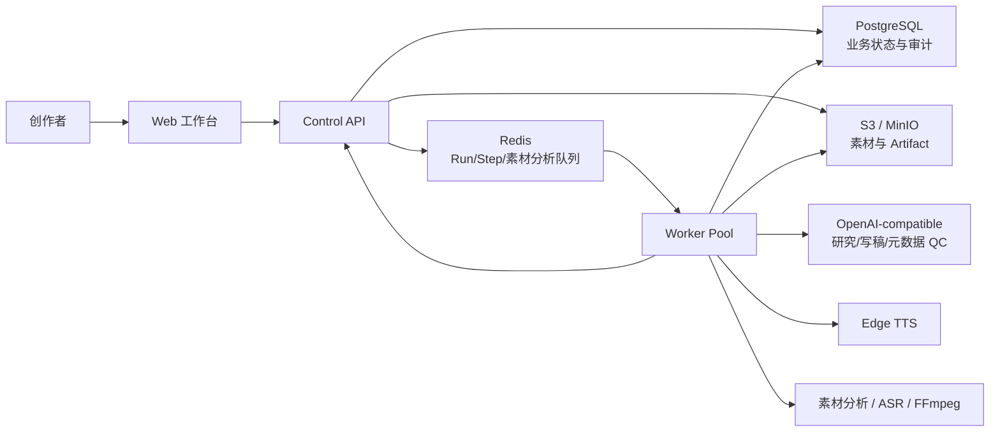
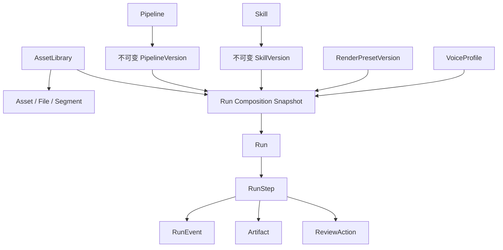
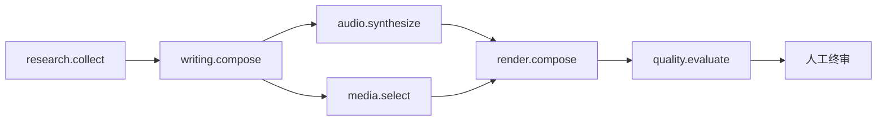
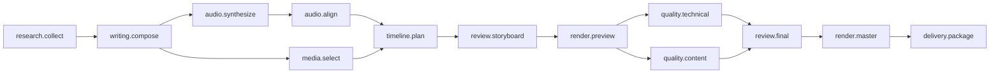

# Vistora v3 技术架构与剪辑成片评审

> 文档分类：历史参考（非当前架构声明）

> **历史快照边界**：本文是旧仓库 v3 在 2026-08-19/20 的评审记录，不是新仓库的现行架构声明。旧路径、端口、Run ID、测试数量和能力判断仅用于追溯；请从 [`../../README.md`](../../README.md) 查阅当前文档，并以当前实现和测试为准。

> 文档状态：历史评审基线（含 2026-08-20 实施校正）
> 评审日期：2026-08-19（Asia/Shanghai）｜实施校正：2026-08-20
> 原评审范围：旧仓库 `v3/` 当时的工作树，包含当时尚未提交的素材分析、时间线规划与渲染改动
> 事实优先级：当前代码与迁移 > 自动化测试 > 本地运行记录 > 历史 README/规划文档

## 1. 结论摘要

### 2026-08-20 实施校正

下文保留 2026-08-19 的原始评审，便于追溯当时问题；以下事实优先于文中相应旧结论：

- 质量检查已经从 `metadata_only` 升级为解码真实音视频，输出流数量、实际时长、黑屏和静音检测；它仍不是逐帧多模态语义审核。
- 时间线已使用结构化 Beat-to-narration 证据和单调全局路径规划；素材片段起止时间为硬边界，最新真实样本 padding 为 0。通用核心不含案例题材词典。
- 素材不足时已经支持按故事 Beat 补采、下载分析、幂等自动恢复和恢复预算；找不到权利及语义均合格的素材时仍 fail closed。
- Edge TTS 使用实测时长反馈进行受限多轮调整；研究与写作增加了未经来源支持的数量声明门禁。
- 新增 `semantic_timeline_v1.json` 与生产时间线算法驱动的自动门禁，用制造、应急和单源人物剧情验证同一机制，并把故障、根因、修复和回归测试变成可执行知识资产。

最新成功样本为 Run `8b63c9f7-2bc9-4476-9441-8b862666fa19`：48.766 秒、1920×1080、H.264/AAC、15 镜头、0 秒 padding、0 秒黑屏、0 秒静音，剧情顺序为耀斑 → CME → 卫星 → 磁层 → 极光。自动补采恢复由 Run `571b7d12-345c-42cf-9095-7fced3c50287` 独立验证。

仍未完成的 P0 是：将时间线从 Render capability 拆成正式 Pipeline 独立步骤、保存 Top-K 候选与完整评分证据、建立真实长电影的人工金标集，以及增加逐帧语义/人物连续性 QC。

Vistora v3 已经从旧版“固定账号 + 本地目录脚本”重构成一套边界基本清晰的内容生产平台：Web、Control API、Worker、PostgreSQL、Redis 和 S3/MinIO 分工明确；Skill、Pipeline、Run 与 Artifact 都有持久化契约；任务具备租约、重试、取消、人工审核、幂等和崩溃恢复能力。控制面与任务内核已经接近可用的单机 Beta。

当前最薄弱的不是“能否输出 MP4”，而是“输出的 MP4 是否可以被系统证明为合格成片”。本地已有 90 秒、1920×1080、H.264/AAC 的真实成功样本，但当前自动质检只读取 Artifact 元数据，不能观看视频；时间线仍允许语义分数接近 0 的镜头、短片段定格补时和重复画面通过。因而现阶段的 `succeeded` 更接近“流水线及人工审核闭环成功”，还不能等同于“剪辑质量达到发布标准”。

建议下一阶段把工作重心从继续增加控制面功能，转向三项 P0：

1. 把时间线规划从渲染器内部拆成可查看、可修改、可重试的独立步骤；
2. 建立真正读取音视频内容的技术 QC、语义 QC 和版权 QC，禁止仅靠 metadata-only 报告宣告成片成功；
3. 将整部源片复制进每个 Run 的做法改为不可变素材引用与按需代理片段，降低存储、网络和渲染成本。

综合成熟度判断：

| 领域 | 当前成熟度 | 判断 |
|---|---|---|
| 契约与领域模型 | 较高 | 核心资源已 Schema/OpenAPI 化，版本和 Run 快照设计正确 |
| 控制面 API | 中高 | 生命周期、并发控制、幂等和持久化较完整，但代码开始单体膨胀 |
| Worker 调度内核 | 中高 | 状态机、租约、恢复、审核和重试较扎实 |
| 素材入库与分析 | 中 | 已有安全、版权、镜头边界、字幕/ASR 数据链路，仍在快速迭代 |
| 自动剪辑与渲染 | 中低 | 能真实出片，但时间线、音频后期、视觉质量和成本控制不足 |
| 自动质量验证 | 低 | 当前仅 metadata-only，核心发布质量仍依赖人工 |
| 生产安全与租户隔离 | 低到中 | 适合单用户本地部署；正式公网认证与 RLS 尚未启用 |

## 2. 新版边界与目录

新版唯一工作目录是 `v3/`。仓库根部同名的 `apps/`、`services/`、`packages/` 是复制前快照；旧业务实现位于上一级 `src/`，只应作为迁移输入。运行新版时不得反向依赖旧目录。

```text
v3/
├─ apps/
│  ├─ web/                  # React 19 + TypeScript + vinext，用户工作台
│  └─ api/                  # FastAPI 控制面、业务服务和持久化适配器
├─ services/worker/         # Python Worker、状态机、Provider 与媒体处理
├─ packages/
│  ├─ contracts/            # JSON Schema + OpenAPI v1
│  └─ seeds/                # 官方 Skill 与 Pipeline 声明式种子
├─ db/migrations/           # PostgreSQL 领域表与素材智能迁移
├─ deploy/                  # 本地依赖与生产 Compose/Docker 基线
├─ tests/                   # 跨包契约测试
├─ tools/                   # 发布门禁、素材任务和迁移工具
└─ var/                     # 日志、密钥、QA 产物、备份；不进入版本库
```

这一隔离方向是正确的，但当前仓库仍同时保留根目录新版快照、`v3/` 新版和 `src/` 旧版，开发人员很容易在错误目录修改代码。完成 v3 切换后，应将根目录重复实现冻结为只读归档或移出主分支。

## 3. 运行时架构



### 3.1 Web

`apps/web` 使用 typed adapter 隔离页面与后端。正式运行路径固定使用 HTTP adapter，Mock 只作为测试夹具。当前已接入：

- 创作与运行预检；
- 项目列表、Run 详情、取消、失败步骤重试、人工审核；
- Skill 创建、草稿、校验、发布、分叉和版本对比；
- 素材库、上传、远程导入、素材详情、分析状态和批量操作；
- 批量生成任务；
- 账户资料、偏好、Session 与 API Key 管理界面。

频道、RenderPreset 和 Pipeline 管理仍是占位能力。频道列表当前直接返回空数组，读取和保存返回 `NOT_SUPPORTED`。

### 3.2 Control API

`apps/api` 是控制面，不直接执行耗时媒体任务。其核心职责是：

- 解析唯一默认用户与默认工作区；
- 校验请求与持久化资源契约；
- 解析 SkillVersion、PipelineVersion 与生产参数；
- 创建不可变 Run composition snapshot；
- 以 `Idempotency-Key` 防止重复写入；
- 以 `ETag` / `If-Match` 处理草稿和账户设置的并发修改；
- 将 Run 或素材分析命令写入 Redis，同时依靠 PostgreSQL 扫描补偿发布间隙；
- 为 Artifact 生成短期签名下载地址，JSON/文本支持受限的 inline 预览。

生产状态使用 PostgreSQL；内存 Repository 仅供测试和 UI 联调。当前 API 通过环境变量获取 Worker 能力清单，在创建 Run 前检查 Pipeline 的 operation 是否都有 Provider。

### 3.3 Worker

`services/worker` 由三层组成：

1. `runtime/`：Run/Step 状态机、租约、心跳、CAS 修订、重试退避、取消、人工审核和恢复；
2. `steps/`：声明式 operation 到 capability 的精确映射；
3. `worker/adapters/`：PostgreSQL、Redis、S3、OpenAI-compatible、素材数据库、Edge TTS 和 FFmpeg 的适配实现。

未配置的生产能力会 fail closed，不会生成占位 Artifact 或伪造成功。Redis 是低延迟唤醒路径，PostgreSQL 是持久事实源；Worker 会周期扫描遗漏任务，因此 API 已提交 Run、但 Redis 发布失败时仍可恢复。

### 3.4 数据与对象存储

PostgreSQL 已覆盖 User、Workspace、Skill、Pipeline、Asset、Run、Step、Event、Artifact、Review、API Key、幂等记录、Outbox、用量和素材时序分析等领域。对象存储保存源媒体、研究、脚本、音频、素材清单、视频、时间线与质检报告。

关键一致性设计：

- 已发布 SkillVersion/PipelineVersion 不应原地修改；
- Run 保存版本 ID 与 `content_hash`，执行时再把完整 Skill policy 注入每个 Step 的 `_framefactory` 输入；
- Artifact 使用内容哈希并在重试时校验；
- RunEvent、ReviewAction、AuditLog 等采用追加式记录；
- 数据库迁移有校验和，已应用 SQL 不允许修改。

## 4. 领域模型与数据流



当前主要状态：

```text
Run: queued → running → awaiting_review → succeeded / failed / cancelled

Step: queued → running → retrying → running
                  ├─→ awaiting_review → succeeded
                  ├─→ failed
                  └─→ cancelled
```

人工审核不是外部备注，而是状态机的一部分。`approve` 允许下游继续，`request_changes` 重新打开本步骤，`reject` 终止分支。当前工作树还把审核意见重新注入写稿 Provider，使修改意见能够影响下一次生成。

## 5. 当前视频生产链路

官方 `standard-production` Pipeline 有 6 个节点：



### 5.1 创建与预检

Control API 解析 Skill/Pipeline、用户创作偏好和本次覆盖项，形成 production settings，包括语言、比例、分辨率、目标时长、帧率、布局、字幕、可见性和自动补素材策略。预检会阻止未发布版本或缺失 Provider 的 Pipeline。

局限：预检只验证 operation 名称是否出现在环境变量声明的能力集合中，不做实时 Provider 健康探测，也不评估素材覆盖、模型时长遵循能力、磁盘空间、FFmpeg 编码能力或预计成本；当前成本估算固定为 0 CNY。

### 5.2 研究 `research.collect`

当前实现调用 OpenAI-compatible `/chat/completions`，根据“用户输入 + Skill policy”整理 `research.json`。它不会主动浏览或检索 Web；没有用户提供的可验证来源时，明确输出空 `sources` 并进入人工审核。

因此 operation 名称和 Pipeline capability 中的 `research.web_acquisition` 容易造成误解。现状更准确的名字是 `research.summarize_input`。若产品需要事实研究，必须新增真正的 Search/RAG Provider，并执行 URL、来源类型、发布日期、主张与引文的一一校验。

### 5.3 写稿 `writing.compose`

写稿 Provider 输出标题、完整旁白和场景列表，接收不可变 Run 输入、研究产物、Skill 写作策略和人工修改意见。代码会：

- 将 Run 的目标时长覆盖 Skill 默认时长；
- 依据中文字符数估算旁白区间；
- 尝试最多两次自动修订；
- 检测直接引语与少量禁写词；
- 时长或 grounding 不合格时保留草稿并请求人工审核。

局限：`scenes` 仍是自然语言字符串，没有结构化的叙事段、时间范围、人物、地点、镜头意图、不可用画面和优先级；grounding 检查主要是正则与固定词表，不能证明所有事实均有来源支持。

### 5.4 配音 `audio.synthesize`

当前使用 Edge TTS。首次合成后通过 FFprobe 测量时长，若偏差超过 15%，会自动调整语速再合成一次；最终偏差超过 20%则进入人工审核。

局限：VoiceProfile 只保留在 Run 快照中，没有被解析为实际 Provider 配置；真实声音仍由全局环境变量控制。输出没有词级时间戳、情绪、重音、停顿、响度标准化、降噪、背景音乐或 ducking 信息。

### 5.5 素材分析与选择 `media.select`

素材入库链路已经具备：文件类型检测、恶意扫描、FFprobe、SHA-256、关键帧、视觉分析、镜头边界、字幕/ASR、标签、版权状态和人工审核。只有安全扫描通过、分析完成、状态 ready，且权利为 owned/licensed/public_domain 的片段可进入自动剪辑。

选片时，Worker 以脚本 scene 查询已授权素材库，综合全文相似度、标签命中、cut-safe 和 semantic-complete，加入重复片段、重复视觉描述和相邻时间段惩罚。缺少场景时可通过 Control API 自动导入已确认权利的公开视频，并在分析完成后恢复 media step。

局限：当前仍是 PostgreSQL trigram/标签规则，不是成熟的跨模态向量检索；一个 2.13 GB 的整部电影会作为一个 `asset` Artifact 复制到 Run，再由 manifest 引用多个时间段。这会造成巨大的对象复制、下载、临时磁盘和恢复成本。

### 5.6 时间线与渲染 `render.compose`

当前时间线规划藏在 FFmpeg Render capability 内部。算法按标点切分旁白，以字符权重分配时长，再按 2.2–8 秒生成镜头；使用叙事角色、时间跳转、画面语义、镜头顺序和重复惩罚寻找一条确定性的画面路径。渲染器会严格限制在已索引片段的起止范围内，短片段不足时定格末帧，避免越界进入未选中的对白或场景。

FFmpeg 当前完成：

- `cover` / `contain` 适配；
- `full_frame` / `editorial` 布局；
- 横竖屏分辨率和帧率；
- ASS 句子级字幕；
- H.264 `yuv420p`、AAC、faststart；
- 音视频时长一致性检查；
- 输出 `final.mp4` 和 `edit-timeline.json`。

局限：没有代理预览、转场系统、原声/BGM/SFX 混音、响度与峰值控制、色彩一致性、人脸安全裁切、镜头运动、遮罩、贴纸、片头片尾、品牌组件或平台发布编码矩阵。短片段定格虽然安全，却会直接产生“画面卡住”的观感。

### 5.7 质量检查 `quality.evaluate`

当前模型只接收 Run 输入和 Video Artifact 元数据，代码明确禁止它声称看过视频。报告固定为 `scope=metadata_only`、`verdict=needs_manual_review`，最终必须人工批准。

这项诚实的 fail-honest 设计值得保留，但还不能作为自动成片质量门禁。至少还缺少：

- 解码、时长、分辨率、帧率、音轨、黑帧、冻结帧、静音、削波和 A/V drift 检测；
- 字幕超框、遮挡、断句、错别字、时间覆盖和安全区检测；
- 镜头重复率、语义匹配、人物/时代连续性和情绪节奏检测；
- 事实、版权、敏感内容和平台规范的可验证证据链。

## 6. 本地实测证据

评审时本地 API 与依赖均健康，PostgreSQL 持久化生效。成功样本 Run `ef40ec70-6c8f-4913-81e3-808c977c3054` 生成了：

- 90.23 秒 MP4；
- 1920×1080、30 fps、H.264；
- 24 kHz 单声道 AAC；
- 研究、3 版脚本、配音、素材 manifest、视频、时间线和 QC report。

但该样本也暴露了“技术成功与剪辑成功不一致”：

- 研究来源数为 0，依靠人工批准继续；
- 最终脚本 268 字，低于 90 秒建议的 315–585 字，依靠 TTS 降速到 `-34%` 填满时长；
- 18 个时间线镜头中，多数 `semantic_score` 接近 0；
- 多个 3–6 秒片段为了覆盖旁白，被定格补时约 1–2.2 秒；
- 同一整部电影在 Run 中复制为 2,128,311,438 字节的素材 Artifact；
- QC 只做元数据判断，最终质量依赖人工查看联系表和视频后批准。

另一个 Run `4c6d1d34-c605-4e83-a31c-8391951cd5f0` 在自动补素材后仍因 8 个场景缺覆盖而失败，说明恢复链路能够诚实停止，但远程素材发现、入库分析和再次匹配尚不稳定。

## 7. 当前优势

1. **版本与执行快照正确**：Skill/Pipeline 与 Run 解耦，Run 保存内容哈希，适合复现和审计。
2. **任务内核可靠性较好**：租约、心跳、CAS、重试、取消、人工审核和数据库恢复都有测试覆盖。
3. **失败诚实**：Provider 缺失、素材权利不明或场景覆盖不足时不生成假产物。
4. **素材安全边界较完整**：来源、版权、哈希、扫描、分析、镜头与使用记录均可追踪。
5. **接口层有工程约束**：Schema、OpenAPI、ETag、幂等键、统一错误和请求 ID 已成体系。
6. **前后端没有走 Mock 回退**：生产 Web adapter 通过真实 HTTP 闭环。

## 8. 不足与优化优先级

### P0：阻碍“可发布成片”

| 问题 | 影响 | 建议 |
|---|---|---|
| QC 不读取真实音视频 | `succeeded` 无法证明可发布 | 新增 technical QC、frame/audio QC、multimodal semantic QC；人工终审只能覆盖主观判断，不能替代机器硬门禁 |
| 时间线规划藏在 render 内 | 无法在昂贵渲染前审片、改单镜头或局部重试 | 拆成 `timeline.plan` 独立 Artifact，支持逐镜头编辑、锁镜头和局部重算 |
| 语义低分和定格补时没有硬阈值 | 画面可能与旁白无关或明显卡顿 | 设置最小场景覆盖率、最小语义分、最大重复率、最大定格时长；未达标进入素材审核而不是渲染 |
| 每个 Run 复制整部源片 | 存储、网络、临时磁盘和恢复成本极高 | Artifact 引用不可变 AssetFile；按时间段生成低码率 proxy/mezzanine，最终渲染再读取源文件对应字节范围 |
| `research.collect` 不做外部研究 | 事实类视频易无来源运行 | 改名或接入搜索/RAG，强制 Claim ↔ Source 映射；`minimum_sources` 应成为可执行门禁 |
| 正式请求没有认证，RLS 被禁用 | 不能安全暴露到公网 | 接入身份网关或 API Key 校验；在启用多工作区前完成 RLS 隔离测试，生产环境不得依赖默认用户上下文 |
| 当前测试存在跨层回归 | 新增素材来源和检索计划尚未与契约、API、Web 和旧测试同步 | 先修复 9 个 API、3 个 Worker、1 个 Web 失败用例，再合并当前工作树；详见第 11 节 |

### P1：阻碍规模化与产品完整性

- **RenderPreset/VoiceProfile 未真正解析**：Run 里只保存引用，渲染与声音仍主要依赖全局配置；应在创建 Run 时解析并保存真实不可变版本快照。
- **频道能力只是数据模型占位**：需要完成 Channel CRUD、默认组合、平台编码参数、品牌资源和发布凭据边界。
- **自动补素材链路脆弱**：应区分搜索、权利确认、下载、分析、人工批准与重匹配的状态，加入 Provider 配额、去重和失败原因聚合。
- **Skill 测试不是实际模型评测**：当前 `local_deterministic_v1` 只比较声明式策略；需要离线样例集、真实输出对比、回归指标和预算上限。
- **能力预检是静态环境声明**：应增加 Worker heartbeat/capability registry 表、Provider 健康和容量探测，防止 API 与 Worker 配置漂移。
- **事件是轮询接口**：Run 详情可升级为 SSE；Event 表继续作为可回放事实源。
- **分页在部分路径中先全量读取再切页**：Run/Skill 等列表应把 cursor、排序和筛选下推数据库。
- **缺少真实成本记录**：模型、下载、分析、存储、转码和渲染都应写 UsageRecord，estimate 不应固定为 0。

### P2：工程维护性

- `main.py` 约 2326 行、`postgres_repository.py` 约 3239 行、`service.py` 约 1714 行、Web HTTP adapter 约 1350 行，继续增长会增加冲突与回归风险。应按 Skill、Run、Asset、Account、Batch 拆 router/service/repository。
- 生产能力类名仍带 `legacy`，但已承担正式 TTS/FFmpeg 逻辑。应将兼容目录素材读取与正式媒体引擎分离，避免“迁移桥”成为永久核心。
- `docs/README.md` 和 Worker README 有过期描述，且 v3 文档索引引用了不存在的 `external-video-api.md`。应把发布门禁设为文档链接检查与能力清单一致性检查。
- 根目录快照与 `v3/` 双份实现容易漂移。完成切换后应只保留一个可编辑代码根。

## 9. 建议的剪辑成片目标流水线

现有 6 步 Pipeline 应演进为“策划—素材—时间线—预览—硬质检—终版”的显式工作流：



### 9.1 每一步必须做什么

| 步骤 | 必要工作 | 主要产物 | 硬门禁 |
|---|---|---|---|
| 研究 | 收集来源、拆事实主张、标记不确定性和禁区 | `research.json`、claim-source map | 重要事实有来源；无来源时只能使用用户明确提供事实 |
| 写稿 | 形成钩子、叙事段、旁白、场景意图和平台时长 | `script.json`、story beats | 事实可追溯；旁白时长可合成；场景需求可被素材表达 |
| 配音 | 选 VoiceProfile、韵律、停顿、发音词典、响度 | WAV/MP3、词/句时间戳 | 时长误差、响度、削波、静音比例合格 |
| 素材准备 | 版权、安全、转码、镜头边界、ASR、视觉/人物/地点标签 | asset manifest、proxy refs | 逐场景覆盖；权利和安全状态合格；切点有证据 |
| 时间线规划 | 将每句旁白映射到镜头，处理节奏、连续性和重复 | `edit-timeline.json` / EDL | 语义分、覆盖率、重复率、定格时长、镜头长度达标 |
| 故事板审核 | 联系表、低码率代理预览、逐镜头替换/锁定 | reviewed timeline | 人工只处理创作判断，修改意见可局部回流 |
| 预览渲染 | 字幕、裁切、转场、原声/BGM/SFX、品牌层 | preview MP4 | 无需高码率，必须快速且可重复生成 |
| 技术 QC | 解码、黑/冻帧、响度、峰值、A/V drift、字幕安全区 | technical QC report | 任一硬错误阻止终版 |
| 内容 QC | 事实、画面语义、人物连续性、重复、版权、敏感内容 | content QC report | 每项规则带证据帧、时间码和 issue code |
| Master | 使用锁定 EDL 和源文件高质量渲染 | master MP4 | 输出规格、哈希和可播放性复验 |
| 交付 | 封面、标题、描述、字幕文件、版权清单、发布变体 | delivery package | 包完整、可追溯、平台规格匹配 |

### 9.2 时间线数据建议

`edit-timeline.json` 不应只保存最终镜头，还应支持可编辑决策：

```json
{
  "timeline_version": 3,
  "audio_artifact_id": "...",
  "duration_seconds": 90.2,
  "shots": [
    {
      "id": "shot-001",
      "narration_range": [0.0, 3.7],
      "asset_id": "...",
      "asset_file_id": "...",
      "source_range": [4332.22, 4335.92],
      "crop": "cover",
      "semantic_score": 0.82,
      "cut_evidence": ["shot_boundary", "word_gap"],
      "locked": false,
      "transition_in": "cut",
      "issues": []
    }
  ]
}
```

必须允许用户锁定已满意镜头；重试时只替换未锁定或带 issue 的镜头，避免一次修改导致整条时间线漂移。

### 9.3 成片验收建议

首版可以采用以下可执行门槛：

- 场景需求覆盖率 100%，低于阈值的镜头不得进入 Master；
- 同一虚拟片段连续重复不超过 1 次，全片重复画面占比建议低于 15%；
- 单镜头 2–8 秒，确需长镜头必须有语义或人工锁定理由；
- 定格补时单次不超过 0.35 秒，全片累计不超过 1%；
- 每个视频切点至少有 shot boundary、静音/词间隙、字幕边界中的一种证据；
- 旁白响度、真峰值和最终混音采用明确标准，例如目标约 -14 LUFS、True Peak 不高于 -1 dBTP；
- 字幕覆盖完整旁白，最多两行，不超安全区，不与平台 UI/人物关键区域冲突；
- 视频可完整解码，音视频时长差小于 100 ms，无意外黑帧、冻结帧和长静音；
- 每个外部素材都有来源、权利状态和使用时间段，最终导出 rights manifest。

具体阈值应通过 20–50 条人工标注成片校准，而不是永久写死在代码中。

## 10. 建议实施顺序

### 第一阶段：让“成功”可信

1. 修复当前 API、Worker 与 Web 的跨层回归，并冻结一组人工标注基准片；
2. 拆出 `timeline.plan`，为时间线增加版本、审核、锁镜头和局部重试；
3. 增加 FFprobe/FFmpeg 技术 QC、重复/冻帧/黑帧/静音检测；
4. 将语义低分、场景缺失和超量定格改为硬失败或人工审核；
5. 将 Run 成功条件改为所有 required QC gate 通过且终审批准。

### 第二阶段：降低成本并提升编辑质量

1. 源素材改为引用，增加 proxy/mezzanine 生成与缓存；
2. 引入文本 + 图像/视频 embedding 的混合检索和 rerank；
3. 接入词级 TTS/ASR 时间戳，按句子与停顿规划镜头；
4. 完成原声、旁白、BGM 的响度标准化与 ducking；
5. 实现故事板、联系表和低码率预览的交互式审核。

### 第三阶段：补齐平台能力

1. 真正解析 RenderPresetVersion、VoiceProfile 和 Channel 默认组合；
2. 接入认证、API Key 鉴权和生产 RLS；
3. 上线 Provider heartbeat、SSE、成本/用量与分布式追踪；
4. 将单体 router/service/repository 按领域拆分；
5. 完成平台发布包、Webhook/Outbox 消费和发布后效果回流。

## 11. 本次验证结果

| 检查 | 结果 |
|---|---|
| API 单元/集成测试 | 140 passed，9 failed，1 skipped |
| Worker 测试 | 151 passed，3 failed，1 skipped，12 subtests passed |
| 跨包契约测试 | 27 passed |
| Web 生产构建与测试 | 构建通过；21 passed，1 failed |
| API Ruff | passed |
| Worker Ruff | passed |
| Web ESLint | passed |
| 本地 API `/healthz`、`/readyz` | PostgreSQL 模式，均为 ok |

当前失败集中在两组正在开发中的变更：

1. 新增 `wikimedia` 后，Run Schema 对 `asset_acquisition.sources` 的数量约束仍只允许原有长度，导致 Run、批量任务、官方 Skill Run 和 Web HTTP E2E 共 10 个跨层场景失败，其中 API 9 个、Web 1 个；
2. 新的素材 acquisition query planner 改变了查询词与 fallback 行为，但 3 个数据库素材选择测试尚未同步或实现尚未满足既有契约。

此前失败的“海边旁白混入城市镜头”用例在最终复测时已经通过。当前失败更像尚未收口的工作树改动，而不是已发布基线缺陷，但仍应作为提交或发布阻断项。

## 12. 最终判断

v3 的架构方向是对的：控制面、执行面、契约、状态机和对象存储边界已经建立，不需要推倒重来。下一步最有价值的工作不是继续增加页面或资源表，而是把“自动剪辑”从 FFmpeg 内部的一次性实现升级为独立、可审查、可度量、可局部修订的领域能力。

当系统能够对每一个镜头回答“为什么选它、切点依据是什么、是否重复、是否有版权、与哪句旁白对应、哪些机器和人工门禁已通过”，`succeeded` 才真正代表一条可发布的成片。
