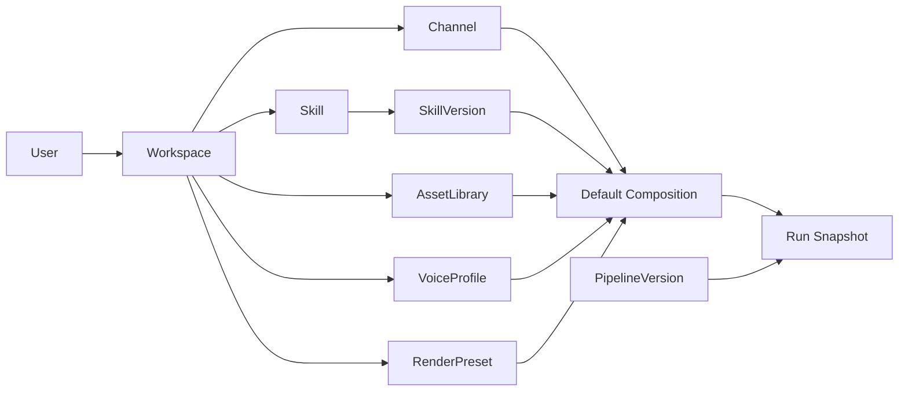
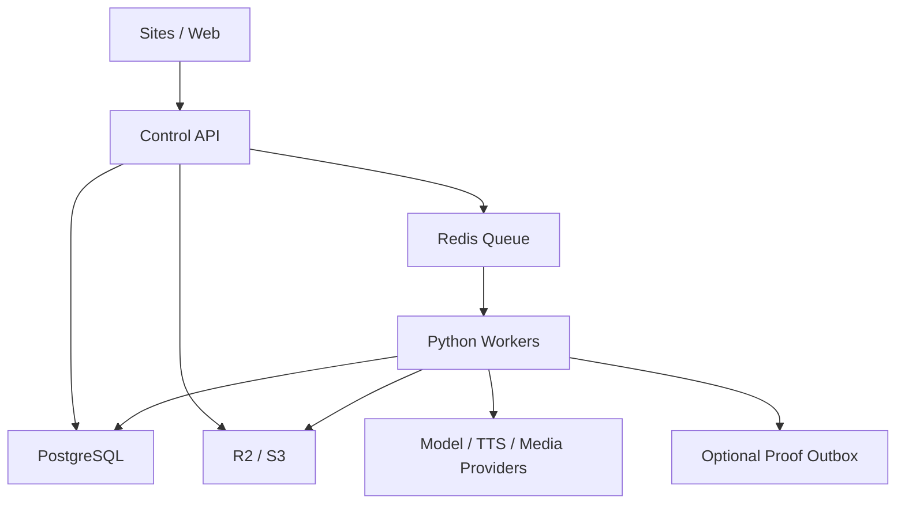

# FrameFactory 通用化重构计划

> 文档分类：历史参考（非当前排期、非操作手册）

> **历史快照边界**：本文是 2026-08-14 的旧仓库重构计划，许多目标已在新 Vistora 骨架中落地，周期和阶段不再是当前排期。保留它是为了说明设计来路，不应据此执行文件迁移、部署或数据操作。现行入口见 [`../../README.md`](../../README.md)。

> 文档状态：历史重构执行计划
>
> 日期：2026-08-14
>
> 目标：从“固定账号驱动的视频脚本集合”重构为“用户可创建、测试、版本化和复用 Skill 的通用内容生产平台”。

> 当前范围决策（2026-08-15）：先交付单用户、单默认工作区版本。
> 数据结构、API 参数和代码抽象保留 Workspace 边界，但本阶段不建设
> 工作区切换、成员邀请、角色管理、跨租户查询或数据库 RLS 强制隔离。

## 1. 最终结果

重构后的 FrameFactory 不再把账号、Skill、素材库和渲染模板绑定为一个配置对象。用户登录后可以：

1. 从空白、官方起点、已有 Skill 分叉或示例内容蒸馏创建自己的 Skill；
2. 在沙盒中测试 Skill，对比多个版本，发布或回滚版本；
3. 创建自己的发布频道，并自由组合 Skill、素材库、声音、渲染预设和质量规则；
4. 为每次任务临时覆盖组合，而不必复制一个新“账号”；
5. 管理素材来源、生产任务、审核、成片、用量和审计记录；
6. 通过同一套 API 和工作台运行官方 Skill 与用户 Skill。

官方能力只是一组由系统工作区拥有、可查看和分叉的种子数据。代码中不再存在 `biography`、`generic`、`genshin`、`booklist`、`ai-frontier` 等具有特殊行为的业务 ID。

## 2. 当前结构为什么必须重构

### 2.1 目录与发布边界混乱

当前 `src/` 约 6.1GB，主要体积不是源码：

| 目录 | 当前体积 | 实际性质 | 目标位置 |
|---|---:|---|---|
| `src/material-library` | 约 3.18GB | 运行素材 | 对象存储；本机开发放 `var/objects` |
| `src/runs` | 约 1.45GB | 任务与成片 | 数据库 + 对象存储；本机放 `var/runs` |
| `src/accounts` | 约 1.35GB | 账号媒体与飞轮数据 | 工作区资源；不进入源码目录 |
| `src/.trash` | 约 142MB | 临时回收内容 | 删除，不进入版本控制 |
| `src/_corpus` | 约 1.57MB | 蒸馏研究语料 | 私有研究存储，按需挂载 |
| `test-results`、根目录 MP4/ZIP | 约 15MB+ | 测试与交付产物 | `var/artifacts`，默认忽略 |

当前容器直接复制整个 `src`，会把语料、素材、运行记录和内部研究一起打入镜像。重构的第一阶段必须先建立“源码、种子数据、运行数据、研究数据、发布产物”五条边界。

### 2.2 领域概念被错误合并

`config/accounts.json` 同时承担：内容账号注册表、Skill 选择、素材路径、飞轮路径、输入表单、抓取策略、写作提示、镜头分类、视觉风格和渲染默认值。结果是：

- 创建一个新内容类型必须复制整份账号配置；
- 一个频道不能灵活切换 Skill；
- 一个 Skill 不能被多个频道可靠复用；
- 素材库、渲染模板和写作方法无法独立版本化；
- 全局 JSON 文件被当作多用户数据库写入；
- 本地服务和 Sites Worker 各自维护一套用户、模板和密码逻辑。

### 2.3 内置行为散落在代码中

当前仍存在以下特殊分支：

- `produce.py` 和素材准备流程对 `biography` 特判；
- 写稿流程对 `modern-biography` 使用隐藏公式；
- 前端与服务端只允许 `ai-frontier` 作为创建起点；
- 渲染只接受 `v5`、`genshin` 和固定版式枚举；
- 素材状态、首页案例和飞轮演示写死现有账号；
- Skill 三件套依赖固定文件名和本地目录扫描；
- 用户模板最终仍写入全局 `accounts.json`。

这些分支必须被能力配置、插件注册和数据库记录替代，而不是继续增加更多 `if account == ...`。

## 3. 重构原则

1. **先清目录，再改领域模型**：没有稳定边界前不搬业务逻辑。
2. **Skill 是声明式能力，不是可执行脚本**：首版用户 Skill 不允许上传任意 Python/JavaScript。
3. **版本不可变**：已用于生产的 SkillVersion、RenderPresetVersion 和 PipelineVersion 不原地修改。
4. **组合优于复制**：频道只引用默认组合；每次 Run 可覆写其中任意一项。
5. **官方与用户同构**：官方内容通过 seed 导入，不走隐藏代码路径。
6. **数据库是结构化状态唯一事实源**：本地 JSON 和目录名不再代表所有权或任务状态。
7. **对象存储承载大文件**：视频、音频、图片、语料、日志归档和成片不进入 Git 或数据库大字段。
8. **任务必须可恢复**：队列、步骤状态、重试、人工审核和幂等键全部持久化。
9. **保留工作区边界但暂不产品化多租户**：业务资源继续带 `workspace_id`，当前由服务端解析唯一默认工作区；授权接口可替换，但本阶段不实现工作区切换、成员体系和 RLS 强制隔离。
10. **先做可验证内核，再做市场与生态**：首版不开放第三方任意代码插件。

## 4. 新领域模型

必须使用以下术语，停止用“账号”同时表示两种身份：

| 概念 | 含义 |
|---|---|
| User | 登录身份 |
| Workspace | 用户或团队的数据与权限边界 |
| Channel | 发布频道/品牌配置，例如某个抖音号；不等于 Skill |
| Skill | 可复用的内容生产方法 |
| SkillVersion | Skill 的不可变版本 |
| AssetLibrary | 可被多个 Skill/Channel 授权使用的素材集合 |
| Source | 网站、上传、API、连接器等素材来源 |
| VoiceProfile | 配音配置与凭据引用 |
| RenderPreset | 画布、字幕、布局、动效和品牌视觉 |
| Pipeline | 可执行步骤图及其能力要求 |
| Run | 一次生产任务，保存当时使用的所有版本快照 |

组合关系：



## 5. 目标目录

```text
FrameFactory/
├─ apps/
│  ├─ web/                         # TypeScript 前端，Sites/CDN 发布
│  └─ api/                         # TypeScript 控制面 API、鉴权、授权、SSE
├─ services/
│  └─ worker/                      # Python 生产 Worker
│     └─ framefactory/
│        ├─ domain/                # Run、Step、Artifact 等领域对象
│        ├─ pipelines/             # 通用步骤与编排适配器
│        ├─ skills/                # Skill 解析、验证、提示构造
│        ├─ research/              # 事实研究与来源处理
│        ├─ media/                 # 采集、切片、索引、匹配
│        ├─ audio/                 # TTS、时间戳、音频处理
│        ├─ render/                # FFmpeg/渲染预设
│        ├─ quality/               # 内容、版权、视觉和技术 QC
│        └─ integrations/          # 模型、对象存储、链上、回调
├─ packages/
│  ├─ contracts/                   # JSON Schema / OpenAPI / 事件契约
│  ├─ skill-sdk/                   # Skill schema、校验、导入导出
│  ├─ ui/                          # 共用 UI 组件与 tokens
│  └─ config/                      # 非秘密的共享配置
├─ db/
│  ├─ migrations/
│  └─ seeds/                       # 官方 Skill/预设种子，不含运行数据
├─ infra/
│  ├─ docker/
│  ├─ cloudflare/
│  └─ observability/
├─ tools/
│  ├─ migrate-v1/                  # 旧账号、Skill、素材和 Run 迁移器
│  └─ dev/
├─ tests/
│  ├─ contract/
│  ├─ integration/
│  └─ e2e/
├─ docs/
│  ├─ architecture/
│  ├─ operations/
│  └─ decisions/                   # 重要 ADR，不保存一次性修复计划
└─ var/                            # 全部忽略；仅本机开发运行数据
   ├─ objects/
   ├─ runs/
   ├─ cache/
   ├─ artifacts/
   └─ research/
```

### 5.1 旧目录迁移表

| 旧位置 | 新位置/处理 |
|---|---|
| `src/frontend/src/experience` | `apps/web/src` |
| `src/frontend/server`、`serve.mjs` | 拆分到 `apps/api`；静态资源由 Web 构建负责 |
| `src/agent` | 按领域拆到 `services/worker/framefactory/*` |
| `src/asset_scraper` | `services/worker/framefactory/media` |
| `src/config/accounts.json` | 迁移到 PostgreSQL；只保留 schema 和 seed |
| `src/ip-skills/*` | 导入 Skill/SkillVersion；官方版本进入 `db/seeds` |
| `src/ip-skills/**/_research` | 私有研究存储，不进入生产镜像 |
| `src/_corpus` | 私有对象存储或独立研究仓库，按需挂载 |
| `src/accounts`、`material-library` | 对象存储 + Asset 数据表 |
| `src/runs`、`src/data` | Run/Step/Event 数据表 + 对象存储 |
| `deploy` | `infra` |
| `vendor` | 构建缓存或独立离线发行物，不放主源码树 |
| `.trash`、根目录 MP4/ZIP、`test-results` | 删除或移入被忽略的 `var/artifacts` |

## 6. Skill 的新契约

### 6.1 Skill 与版本

`skills` 保存身份和权限；`skill_versions` 保存不可变执行规格。建议字段：

```text
skills
  id, workspace_id, name, slug, description, visibility,
  status, current_version_id, forked_from_skill_id,
  created_by, created_at, updated_at

skill_versions
  id, skill_id, version, schema_version, state,
  input_schema, research_policy, writing_instructions,
  visual_policy, asset_policy, qc_rubric, output_contract,
  model_requirements, default_pipeline_version_id,
  content_hash, created_by, created_at, published_at
```

SkillVersion 首版采用受控 JSON + 可编辑 Markdown 指令块。JSON 负责机器契约，Markdown 只承载自然语言方法，不再依赖固定目录和文件名。

### 6.2 用户创建方式

支持四种入口，最终产物完全同构：

1. **空白创建**：填写目标、受众、内容形式、事实边界、风格、禁区和输出规格；
2. **分叉官方 Skill**：复制为用户所有的草稿版本，不修改官方版本；
3. **从示例蒸馏**：上传或引用示例内容，生成研究报告和 Skill 草稿；
4. **导入包**：导入经过 schema 校验的 Skill 包，不执行其中的任意代码。

生命周期：

```text
draft → validating → ready → published → deprecated
          ↓
        rejected
```

发布前必须经过：schema 校验、危险指令检查、至少 3 个测试主题、输出契约检查、事实与版权风险提示、成本预估。发布后修改必须生成新版本。

### 6.3 去内置化规则

- 官方 Skill 由 `system` workspace 拥有，使用同一张表、同一 API、同一执行器；
- “官方”只是 `publisher_type=system` 和审核状态，不是代码分支；
- 官方起点可分叉，不可被普通用户覆盖；
- RenderPreset、Pipeline 和素材策略同样版本化、同样允许引用或复制；
- Python Worker 只读取 Run 快照中的能力配置，不读取账号 ID 决定行为；
- 特殊能力通过 capability 注册，例如 `timeline.word_level`、`render.subtitle_karaoke`、`media.web_acquisition`，缺少能力时在创建 Run 前失败；
- 历史人物、科技、书单、游戏等差异必须存在于 Skill 数据和 RenderPreset 数据中。

## 7. 后端目标架构



### 7.1 数据库

至少建立：

- `users`、`workspaces`、`workspace_members`、`sessions`；
- `channels`、`channel_defaults`；
- `skills`、`skill_versions`、`skill_evaluations`；
- `asset_libraries`、`assets`、`asset_files`、`asset_sources`、`asset_tags`；
- `voice_profiles`、`render_presets`、`render_preset_versions`；
- `pipelines`、`pipeline_versions`；
- `runs`、`run_steps`、`run_events`、`artifacts`、`review_actions`；
- `api_keys`、`idempotency_keys`、`webhooks`、`audit_logs`、`usage_records`；
- `outbox_events`，用于回调、统计和可选链上存证。

每张业务表必须有工作区归属或可证明的系统公共归属。当前运行时只使用
一个配置的个人工作区，并通过 `WorkspaceContextProvider` 注入；未来启用
多工作区时替换上下文和持久化授权实现，不改变资源契约。

### 7.2 任务执行

废弃内存 `Map`、目录队列和直接把 Python 子进程当任务状态。控制面创建 Run 和 Step 记录后进入持久队列，Worker 按能力消费。

Step 状态统一为：

```text
queued → running → awaiting_review → succeeded
             ├→ retrying → running
             ├→ failed
             └→ cancelled
```

所有步骤接收不可变输入快照并输出 Artifact 引用。重试不得覆盖已发布版本或其他用户文件；创建接口必须支持工作区级幂等键。

### 7.3 文件与对象存储

对象键使用不可猜测 ID：

```text
workspaces/{workspace_id}/libraries/{library_id}/assets/{asset_id}/{file_id}
workspaces/{workspace_id}/runs/{run_id}/artifacts/{artifact_id}
system/skills/{skill_id}/{version_id}/...
```

上传与下载使用短期签名 URL。Worker 不通过公共 URL回读用户资产。数据库保存元数据、hash、版权来源、归属和生命周期。

### 7.4 身份与安全

- 只保留一套用户与会话系统；当前只提供个人账户，不提供团队与成员管理；
- API Key 归属工作区，并带 scope、过期时间和最后使用时间；
- 所有资源保留 ID + workspace 归属字段；当前服务端只接受配置的默认工作区；
- 用户 Skill 首版只允许声明式配置，阻止任意代码执行和服务端路径引用；
- 上传文件执行 MIME、magic bytes、ffprobe、大小、时长和恶意内容检查；
- 模型、存储、链上和回调密钥只存服务端秘密系统；
- 链上存证走 outbox，失败不阻断成片完成。

## 8. 前端产品重构

### 8.1 信息架构

主导航建议为：

```text
创作 / 项目 / Skill / 素材 / 频道 / 团队与设置
```

“个人账户”只管理登录、安全、会话和用量；“频道”管理品牌与发布配置；“Skill”管理创作方法。界面不再出现语义含混的“账号模板”。

### 8.2 Skill Studio

必须提供：

- 我的 Skill、官方 Skill、团队 Skill；
- 创建、分叉、导入、导出、删除草稿；
- 结构化编辑器：输入、研究、写作、视觉、素材、质量、输出；
- 测试台：同一输入对比两个版本，展示成本、耗时、检查结果和差异；
- 版本历史：发布说明、创建人、使用次数、回滚/弃用；
- 权限：私有、工作区、公开只读；
- 删除保护：已被 Run 引用的版本只允许弃用，不能物理删除。

### 8.3 创作页

创作页以主题为入口，默认自动使用频道组合，但允许展开高级设置替换 Skill、素材库、声音、版式和 Pipeline。创建前显示能力缺口和成本预估；执行中显示持久化步骤状态与人工审核点。

## 9. 分阶段实施

### Phase 0：安全整理目录（2–3 天）

目标：不改变生产行为，只建立可重构的干净工作区。

1. 对当前 1478 项工作区变更建立可恢复检查点；
2. 生成“源码、配置、种子、运行数据、研究数据、临时产物”清单；
3. 删除 `.trash`、过期测试输出和重复交付包；
4. 将 `runs`、素材、账号媒体、根目录视频迁出源码树；
5. 建立 `var/` 与忽略规则；
6. 将 `_corpus` 和 `_research` 从生产镜像排除；
7. 修复 Docker 构建上下文，镜像只复制必要代码和官方 seed；
8. 添加脚本检查：禁止大媒体、`.env`、研究语料和运行目录进入提交或镜像。

验收：源码仓库不依赖现有运行目录启动单元测试；生产镜像不包含私钥、原始语料、用户媒体或历史 Run。

### Phase 1：建立新骨架与契约（3–5 天）

创建目标目录，但暂时通过适配器调用旧 Worker。先定义 OpenAPI、事件、Skill、Run、Artifact 和 RenderPreset schema；建立跨语言契约测试。

验收：新 API 能创建一个使用旧管线执行的兼容 Run，所有输入输出符合新契约。

### Phase 2：统一身份、数据库和对象存储（单工作区，1–2 周）

引入 PostgreSQL、对象存储和 Redis；统一个人用户、默认工作区、会话与资源归属；废弃 Sites 与本地两套独立用户/模板存储。保留 Workspace 上下文接口，但不实现成员邀请、角色管理、工作区切换和跨租户能力。

验收：所有资源由服务端写入同一个配置工作区，客户端不能切换工作区；服务重启后会话、任务和资源仍可恢复；未来上下文实现可替换且不改变 API 资源结构。

### Phase 3：实现通用 Skill Engine（1–2 周）

实现 Skill CRUD、版本、分叉、导入导出、校验、测试和发布；把现有官方三件套迁移为 seed；删除固定目录扫描和固定 ID 分支。

验收：用户从空白创建 Skill，发布 v1，创建 v2，并分别成功生成任务；官方 Skill 通过同一 API 执行。

### Phase 4：拆分频道、素材、渲染和 Pipeline（1–2 周）

建立独立资源及组合关系；把传记特判、游戏模板、素材回退和版式枚举改成能力配置与版本化预设。

验收：一个频道能切换两个 Skill；一个 Skill 能被两个频道复用；同一 Skill 能分别使用两个 RenderPreset 出片。

### Phase 5：持久任务与 Worker 重构（1–2 周）

把六阶段流程迁为可恢复 Step；拆分研究、写稿、TTS、素材、渲染、QC 队列；完善人工审核、取消、重试、幂等和 outbox。

验收：任意步骤杀进程后可恢复；重复请求只产生一个 Run；失败重试不会重复计费或覆盖其他产物。

### Phase 6：重做前端 Skill Studio（1–2 周）

落地新信息架构、Skill 创建/测试/版本、频道组合、素材权限和个人账户中心；修复移动端导航、空状态、术语和可访问性。

验收：新用户无需接触内置账号即可完成“注册 → 创建 Skill → 测试 → 发布 → 出片 → 下载”。

### Phase 7：迁移、灰度与发布（1 周）

运行 `migrate-v1`：旧账号变 Channel，旧三件套变 SkillVersion，素材目录变 AssetLibrary，历史 Run 只读导入。完成备份恢复、单工作区授权、负载、安全和故障演练；多租户隔离演练留到启用该能力的后续里程碑。

验收：旧数据迁移报告可追溯；发布环境不访问旧 `accounts.json`、`ip-skills` 路径或 `runs` 目录。

## 10. 第一批实际整理动作

下一轮实施只做 Phase 0，避免目录移动和业务重写同时发生：

1. 保存当前工作区检查点和变更清单；
2. 创建目标骨架、`var/` 和统一忽略规则；
3. 将根目录 MP4、ZIP、测试输出和离线交付物移到 `var/artifacts`；
4. 清除 `src/.trash`；
5. 将 `_corpus`、Skill `_research` 与生产构建解耦；
6. 把运行数据迁到工作区外的明确数据根目录，并用环境变量接入旧代码；
7. 收紧 Docker 复制范围；
8. 运行现有测试，形成重构前基线；
9. 输出旧路径到新路径的机器可读迁移清单；
10. Phase 0 验收通过后，才开始数据库和 Skill Engine 改造。

## 11. 总体验收标准

- 业务代码中不存在针对官方业务 ID 的特殊条件分支；
- 用户可以创建、测试、发布、分叉和版本化 Skill；
- 官方 Skill 与用户 Skill 使用完全相同的存储、API、执行和权限路径；
- Channel、Skill、AssetLibrary、VoiceProfile、RenderPreset、Pipeline 可以独立组合；
- 所有运行资源有明确工作区归属，当前统一归入服务端配置的默认工作区；
- 任务在服务或 Worker 重启后可恢复；
- 源码仓库与生产镜像不包含用户媒体、原始研究语料、运行目录或真实密钥；
- 发布前通过契约、集成、端到端、单工作区授权、幂等、恢复、备份和并发测试；
- 文档只保留当前架构、运营手册、API 和重要决策，不再积累一次性修复计划。

## 12. 预计周期

单人全职重构约 8–12 周；2–3 人并行约 5–8 周。最小可发布闭环应完成 Phase 0–6，不能只完成前端 Skill 创建页面而继续把结果写回全局 `accounts.json`。
